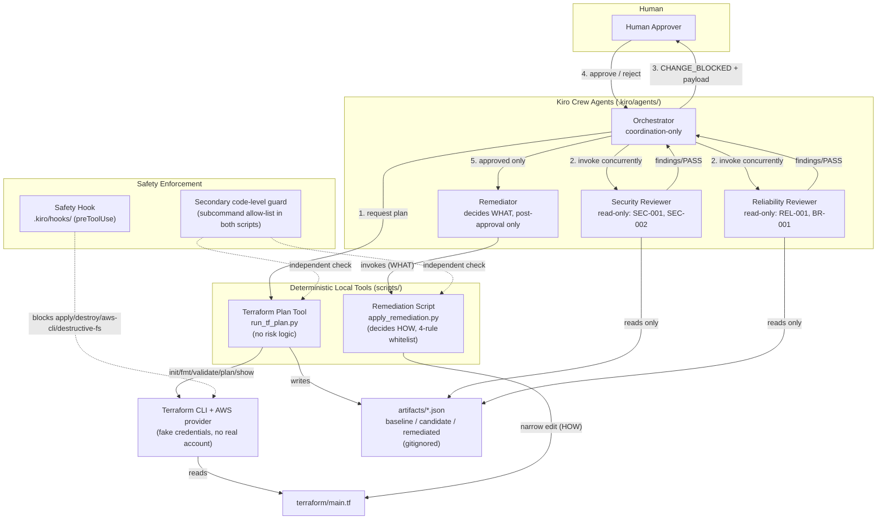
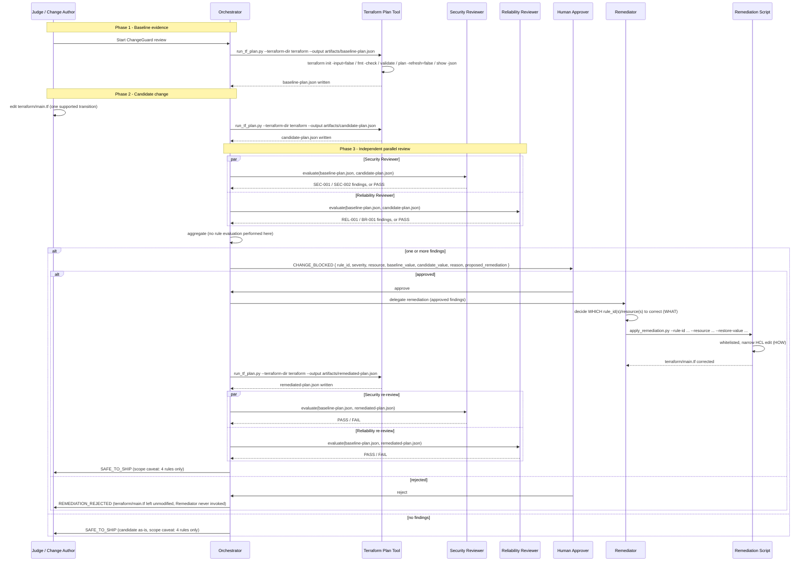

# Design Document: ChangeGuard AI (change-review)

## Overview

ChangeGuard AI is a Kiro Crew workflow that reviews a proposed change to `terraform/main.tf` against four deterministic rules (`SEC-001`, `SEC-002`, `REL-001`, `BR-001`) by diffing two or three genuine Terraform plan JSON artifacts. It never applies infrastructure, never calls AWS, and never lets an LLM edit HCL directly. It runs entirely on the Kiro Crew agent framework, the real Terraform CLI (with the AWS provider), the Python 3 standard library, and Git — nothing else (Requirement 1).

This design is intentionally narrow. It defines exactly four Kiro Crew agents (Orchestrator, Security Reviewer, Reliability Reviewer, Remediator), exactly two deterministic local scripts (`scripts/run_tf_plan.py`, `scripts/apply_remediation.py`), and one Kiro safety hook. No additional agents, rule IDs, cloud integrations, or infrastructure are introduced. Everything listed in the requirements document's "Out of Scope" section (IAM/S3/encryption analysis, OPA/Checkov/tfsec, GitHub PR automation, MCP servers, Bedrock, Lambda, ECS/RDS deployment, LocalStack, Docker, any frontend/database/telemetry) is a non-goal and does not appear anywhere below as an implemented capability.

Key design commitments carried through every section:

- **Two-plan evidence rule** (Requirement 3, steering doc "Evidence"): a finding is only ever produced by comparing the *after* values of two independently generated `terraform show -json` outputs — never by reading `terraform/main.tf` source, and never by reading the `before`/`after` diff *inside* a single plan (explained in detail in "Baseline/Candidate/Remediated Evidence Model" below).
- **Separation of coordination from rule logic** (Requirement 4.8): the Orchestrator never evaluates SEC-001/SEC-002/REL-001/BR-001 itself.
- **Separation of decision from mechanism** (Requirement 9): the Remediator (an LLM-driven agent) decides *what* to fix; a deterministic, whitelisted Python script decides *how* to edit the file.
- **Human control** (Requirement 8, steering doc "Human control"): `terraform/main.tf` is never modified without an explicit human approval step.
- **Structural safety** (Requirement 11, steering doc "Safety"): `terraform apply`, `terraform destroy`, AWS CLI calls, and destructive filesystem operations are blocked by a Kiro hook and by a second, independent code-level guard.

## Architecture



Kiro-specific mapping:

- Orchestrator, Security Reviewer, Reliability Reviewer, and Remediator are each defined as a separate Kiro Crew custom agent under `.kiro/agents/` (created during implementation, not in this design phase).
- `run_tf_plan.py` and `apply_remediation.py` are plain Python 3 stdlib scripts under `scripts/`, invoked by agents as tools — they contain no LLM calls and no rule logic.
- The Safety Hook is a Kiro hook under `.kiro/hooks/`, registered as `preToolUse` against shell-executing tool calls workspace-wide (not scoped to a single agent), matching Requirement 11's "network-wide" intent.
- `artifacts/` and `terraform/main.tf` are the only pieces of on-disk state the workflow reads or writes.

## End-to-End Workflow



This diagram is the authoritative statement of control flow for Requirements 2–10 and 13.

## Baseline/Candidate/Remediated Evidence Model

### Why three artifacts, and why not a single plan's before/after

A freshly cloned repository has no `.tfstate`. Every `terraform plan` run in this workflow therefore plans a **create** action for each resource: `change.actions == ["create"]`, `change.before == null`, `change.after == <planned attributes>`. Because `before` is always `null` on a stateless clone, the `before`/`after` pair *inside one plan JSON file* carries no historical information — it cannot tell you what the configuration used to be. Relying on it would mean fabricating a "before" that Terraform never actually observed, which is exactly what Requirement 3 and the steering doc's "Evidence" principle forbid.

ChangeGuard works around this by never trusting a single plan's internal diff. Instead, it generates the **same kind of plan twice** (or three times) against two different versions of `terraform/main.tf`, and compares the `after` value of one plan against the `after` value of the other:

| Artifact | Generated from | Written to |
|---|---|---|
| Baseline Plan | the safe, unmodified `terraform/main.tf` | `artifacts/baseline-plan.json` |
| Candidate Plan | `terraform/main.tf` after the injected change | `artifacts/candidate-plan.json` |
| Remediated Plan | `terraform/main.tf` after approved, deterministic correction | `artifacts/remediated-plan.json` |

Every rule check compares **Baseline `after` vs. Candidate `after`** (pre-approval) or **Baseline `after` vs. Remediated `after`** (post-approval). Baseline is never compared to itself, and a plan's own `before` field is never read for rule evaluation.

### Generation commands (Terraform Plan Tool)

Both plan-generation calls (baseline and candidate/remediated) run the identical sequence against `terraform/main.tf`:

1. `terraform init -input=false`
2. `terraform fmt -check`
3. `terraform validate`
4. `terraform plan -refresh=false -out=<tmpfile>`
5. `terraform show -json <tmpfile>`

Step 5's stdout is written verbatim to the target artifact path. The tool performs no interpretation of the JSON — see "Terraform Plan Tool" below.

### JSON paths inspected per rule

All four rules read from the plan JSON's top-level `resource_changes` array (the standard `terraform show -json` schema), matching entries by `.address`, and reading only `.change.after` (never `.change.before`):

**SEC-001 — TCP/22 becomes public**
- Resource: `resource_changes[] | select(.address == "aws_security_group.payments_sg")`
- Field: `.change.after.ingress[]` — an array of ingress block objects, each with `.from_port`, `.to_port`, `.protocol`, `.cidr_blocks` (array of strings)
- Match rule: the ingress entry where `from_port <= 22 <= to_port` and `protocol` is `"tcp"` (or `"-1"`)
- Finding condition: in Baseline, that entry's `cidr_blocks` does **not** contain `"0.0.0.0/0"`; in Candidate/Remediated, the corresponding entry's `cidr_blocks` **does** contain `"0.0.0.0/0"`

**SEC-002 — TCP/5432 becomes public**
- Same resource and field path as SEC-001, but matching the ingress entry where `from_port <= 5432 <= to_port`
- Same finding condition, applied to port 5432 instead of port 22

**REL-001 — ECS desired_count drops to 1**
- Resource: `resource_changes[] | select(.address == "aws_ecs_service.payments_api")`
- Field: `.change.after.desired_count` (integer)
- Finding condition: Baseline `desired_count >= 3` and Candidate/Remediated `desired_count == 1`

**BR-001 — RDS deletion_protection disabled**
- Resource: `resource_changes[] | select(.address == "aws_db_instance.payments_db")`
- Field: `.change.after.deletion_protection` (boolean)
- Finding condition: Baseline `deletion_protection == true` and Candidate/Remediated `deletion_protection == false`

For every rule, if the resource address is missing from either plan, if the field is absent or not the expected type, or if the ingress array has no entry covering the relevant port, the reviewer treats the evidence as insufficient and reports **no finding** for that rule (Requirements 3.3, 5.6, 6.6) rather than guessing.

## Components and Interfaces

### Orchestrator (Kiro Crew agent — coordination-only)

- **Role**: drives the workflow shown in the sequence diagram above: requests plan generation, invokes both reviewers, aggregates their results, runs the human approval gate, delegates remediation, triggers post-remediation verification, and emits the final verdict.
- **Allowed inputs**: reviewer results (finding lists or PASS), human approval/rejection decision, Terraform Plan Tool success/failure status.
- **Allowed outputs**: invocations of the Terraform Plan Tool, invocations of Security Reviewer / Reliability Reviewer / Remediator, the `CHANGE_BLOCKED` / `SAFE_TO_SHIP` / `REMEDIATION_REJECTED` payloads presented to the human.
- **Permission boundary**: coordination-only. It never reads plan JSON to make a rule decision, never writes to `terraform/main.tf`, and never invokes `apply_remediation.py` directly (Requirement 4.8). It is the only agent allowed to invoke the Remediator, and only after receiving an explicit approval signal.

### Security Reviewer (Kiro Crew agent — read-only)

- **Role**: evaluates SEC-001 and SEC-002 only, using the JSON paths defined above.
- **Allowed inputs**: paths to exactly two plan JSON artifacts (Baseline + Candidate, or Baseline + Remediated), supplied by the Orchestrator.
- **Allowed outputs**: a list of zero or more findings, each shaped as the `CHANGE_BLOCKED` finding record (see "Human Approval Gate" below), restricted to `rule_id ∈ {SEC-001, SEC-002}`.
- **Permission boundary**: read-only. It cannot write any file, cannot execute `apply_remediation.py` or any Terraform command, and cannot report any security observation outside SEC-001/SEC-002 (Requirement 5).

### Reliability Reviewer (Kiro Crew agent — read-only)

- **Role**: evaluates REL-001 and BR-001 only, using the JSON paths defined above.
- **Allowed inputs**: the same two-artifact-path input shape as the Security Reviewer.
- **Allowed outputs**: a list of zero or more findings restricted to `rule_id ∈ {REL-001, BR-001}`.
- **Permission boundary**: read-only, identical constraints to the Security Reviewer, plus: if evaluation of REL-001 or BR-001 fails to complete (exception, timeout, malformed input encountered mid-check), it must not emit a finding for the rule that didn't finish (Requirement 6.7) — see "Error Handling."

### Remediator (Kiro Crew agent — post-approval only, decides WHAT)

- **Role**: after the Orchestrator delegates an *approved* set of findings, determines which supported `rule_id` and `resource` each approved finding maps to, and what the correct restore value is (always the Baseline value recorded in that finding — remediation restores the safe baseline behavior, never an arbitrary value).
- **Allowed inputs**: the approved finding record(s) only (never raw plan JSON, never `terraform/main.tf` directly).
- **Allowed outputs**: exactly one `apply_remediation.py` invocation per approved finding, passing `--rule-id`, `--resource`, and `--restore-value` taken from the finding's `baseline_value`.
- **Permission boundary**: can-invoke-script, not can-write-file. It never opens or edits `terraform/main.tf` itself (Requirement 9.4) — all HCL mutation happens inside the whitelisted script. It cannot be invoked before human approval (Requirement 9.6), and it must refuse (block, not guess) any finding whose `rule_id` is outside `{SEC-001, SEC-002, REL-001, BR-001}` (Requirement 9.7).

### Parallel Reviewer Execution

Security Reviewer and Reliability Reviewer are modeled as two independent Kiro Crew agent invocations issued by the Orchestrator within the same orchestration step. Each invocation:

- receives only the two artifact file paths for that comparison cycle as input (no shared mutable state, no reference to the other reviewer's invocation or result);
- runs to completion and returns a self-contained result (finding list or PASS) with no ordering dependency on the other reviewer.

Because there is no data dependency between the two calls, the Orchestrator issues them as independent, concurrently-invokable Kiro Crew agent tasks in the same turn — the same "independent calls with no dependency between them run together" pattern Kiro Crew uses for any set of unrelated agent/tool invocations — rather than sequentially awaiting one before starting the other. This satisfies Requirement 7: neither reviewer's finding set is computed from, or gated on, the other reviewer's finding set. The Orchestrator's aggregation step is a pure union of the two independently-returned finding lists; it performs no rule logic of its own (Requirement 4.3, 4.8).

### Human Approval Gate

- **Where it pauses**: immediately after the Orchestrator aggregates one or more findings from the parallel review of Baseline vs. Candidate. The workflow stops *before* the Remediator is invoked and *before* `terraform/main.tf` is touched (Requirement 8.3, 4.4).
- **`CHANGE_BLOCKED` payload** presented to the Human Approver — one record per finding:

  | Field | Description |
  |---|---|
  | `rule_id` | `SEC-001` \| `SEC-002` \| `REL-001` \| `BR-001` |
  | `severity` | Fixed per rule: SEC-001/SEC-002/BR-001 = `CRITICAL`, REL-001 = `HIGH` (design-time severity mapping; not otherwise specified by requirements) |
  | `resource` | Terraform resource address, e.g. `aws_security_group.payments_sg` |
  | `baseline_value` | Value read from `artifacts/baseline-plan.json` at the JSON path for that rule |
  | `candidate_value` | Value read from `artifacts/candidate-plan.json` at the same path |
  | `reason` | Human-readable statement of the rule violated, e.g. "TCP/22 ingress became public via 0.0.0.0/0" |
  | `proposed_remediation` | The restore action, e.g. "Restore `cidr_blocks` on the port-22 ingress rule of `aws_security_group.payments_sg` to `baseline_value`" |

- **Capturing the decision**: the Human Approver responds with an explicit approve or reject signal for the presented `CHANGE_BLOCKED` payload (the concrete UI/CLI mechanism for capturing this signal is an implementation detail for the tasks phase; the design constraint is that it must be an explicit, out-of-band human action, not an inferred or default agent decision).
- **Approved path**: Orchestrator invokes the Remediator with the approved finding(s); Remediator invokes `apply_remediation.py`; a fresh Remediated Plan is generated and re-reviewed; Orchestrator reports `SAFE_TO_SHIP` only if that re-review is clean (Requirement 8, 10).
- **Rejected path**: Orchestrator reports `REMEDIATION_REJECTED`, leaves `terraform/main.tf` unmodified, and never invokes the Remediator (Requirement 8.4, 8.5). The workflow stops there — there is no retry loop implied by this design.

### Terraform Plan Tool — `scripts/run_tf_plan.py`

- **CLI contract**: `python3 scripts/run_tf_plan.py --terraform-dir <path> --output <path>`
- **Behavior**: runs, in order, `terraform init -input=false`, `terraform fmt -check`, `terraform validate`, `terraform plan -refresh=false -out=<tmp>`, `terraform show -json <tmp>` against `--terraform-dir`, and writes the final command's stdout byte-for-byte to `--output`. Each subprocess call uses an argv list (never a shell string), and the subcommand (`init`/`fmt`/`validate`/`plan`/`show`) is checked against a fixed allow-list before invocation — this is the "secondary enforcement" guard referenced in Requirement 11.6 and detailed under "Kiro Hook / Safety Strategy."
- **Explicitly excluded**: any risk-detection or rule-evaluation logic (Requirement 2.3); any `terraform apply` or `terraform destroy` invocation, under any argument combination (Requirement 2.4) — these subcommands are simply not in the tool's allow-list, so there is no code path that can reach them.

### Remediation Script — `scripts/apply_remediation.py`

- **CLI contract**: `python3 scripts/apply_remediation.py --terraform-dir <path> --rule-id <SEC-001|SEC-002|REL-001|BR-001> --resource <address> --restore-value <value>`
- **Behavior**: looks up `--rule-id` in a fixed 4-entry whitelist mapping `rule_id → (expected resource type, expected HCL attribute/block, value type)`. If `--rule-id` is not one of the four supported IDs, or `--resource` does not match the expected resource type/address for that rule, the script exits non-zero and writes nothing (Requirement 9.7's script-level backstop). If it matches, the script performs one narrowly scoped, targeted edit to `terraform/main.tf` — e.g. rewriting the `cidr_blocks` list on the matched port-22 ingress block, the `desired_count` value, or the `deletion_protection` value — and nothing else in the file.
- **Explicitly excluded**: any generic "write these bytes to this path" capability (Requirement 9.5). The script has no file-path argument other than `--terraform-dir`, and no free-form content argument other than the single, type-checked `--restore-value` for the one whitelisted attribute the given `--rule-id` is allowed to touch.
- **WHAT vs. HOW split**: the Remediator (LLM agent) decides *which* finding to act on and *what* the restore value should be (always sourced from that finding's recorded `baseline_value`, never invented). The script decides *how* the edit is mechanically performed — the exact text/AST manipulation of `terraform/main.tf` — and independently validates that the requested value is of the correct type for the rule (int for REL-001, bool for BR-001, a CIDR-list string for SEC-001/SEC-002) before writing.

## Data Models

All data ChangeGuard passes between components is plain JSON (plan artifacts) or plain in-memory records (finding payloads) — there is no database and no persisted schema beyond the three artifact files.

### Terraform Plan JSON (`baseline-plan.json` / `candidate-plan.json` / `remediated-plan.json`)

Standard `terraform show -json` output, unmodified. The fields ChangeGuard relies on:

```text
{
  "resource_changes": [
    {
      "address": "aws_security_group.payments_sg",
      "type": "aws_security_group",
      "change": {
        "actions": ["create"],
        "before": null,
        "after": {
          "ingress": [
            { "from_port": 22, "to_port": 22, "protocol": "tcp", "cidr_blocks": ["10.0.0.0/8"] }
          ]
        }
      }
    },
    {
      "address": "aws_ecs_service.payments_api",
      "type": "aws_ecs_service",
      "change": { "actions": ["create"], "before": null, "after": { "desired_count": 3 } }
    },
    {
      "address": "aws_db_instance.payments_db",
      "type": "aws_db_instance",
      "change": { "actions": ["create"], "before": null, "after": { "deletion_protection": true } }
    }
  ]
}
```

ChangeGuard treats this structure as read-only, third-party-owned data (produced by the real Terraform binary) and never edits or fabricates it. Only `resource_changes[].address` and `resource_changes[].change.after.*` are read, per the JSON paths defined in "Baseline/Candidate/Remediated Evidence Model."

### Finding record (internal — Reviewer → Orchestrator)

Each reviewer returns a list of zero or more records of this shape (this is also the basis of the `CHANGE_BLOCKED` payload field table in "Human Approval Gate"):

```text
Finding {
  rule_id: "SEC-001" | "SEC-002" | "REL-001" | "BR-001"
  severity: "CRITICAL" | "HIGH"
  resource: str            # Terraform resource address
  baseline_value: <str | int | bool>
  candidate_value: <str | int | bool>   # or remediated_value, on the post-remediation cycle
  reason: str
  proposed_remediation: str
}
```

`baseline_value`/`candidate_value` types follow the field they were read from: a CIDR string list summary for SEC-001/SEC-002, an int for REL-001, a bool for BR-001.

### Reviewer result (internal — Reviewer → Orchestrator)

```text
ReviewResult {
  status: "PASS" | "FINDINGS" | "INCOMPLETE"
  findings: list[Finding]     # empty when status is PASS or INCOMPLETE
}
```

`INCOMPLETE` is the status the Reliability Reviewer returns for a rule whose evaluation did not finish (Requirement 6.7) — it is distinct from `PASS` so the Orchestrator never treats a failed evaluation as evidence of safety.

### Remediation invocation record (internal — Remediator → Remediation Script, via CLI args)

```text
RemediationRequest {
  rule_id: "SEC-001" | "SEC-002" | "REL-001" | "BR-001"   # whitelist-checked by the script
  resource: str
  restore_value: <str | int | bool>   # always sourced from the approved finding's baseline_value
}
```

## Correctness Properties

*A property is a characteristic or behavior that should hold true across all valid executions of a system — a formal statement about what the system should do. Properties serve as the bridge between human-readable specifications and machine-verifiable correctness guarantees.*

This design does not use a generator/shrinking property-based testing (PBT) library (e.g. Hypothesis for Python). Requirement 1.4 forbids any Python dependency outside the standard library, and Requirement 12.1 mandates the `unittest` module specifically — no mainstream PBT library ships in the standard library, so adopting one would violate both constraints. That reasoning does not, however, mean the design has no formal correctness properties. A correctness property is simply a formal, testable statement about system behavior; it does not require a generator/shrinking library to state or to check. The properties below are derived directly from requirements.md and are each verified through the existing stdlib example-based/fixture tests described in "Testing Strategy" — using hand-constructed representative cases, not generated/PBT-style random inputs.

### Property 1: Two-genuine-plan evidence requirement

For all findings reported by the ChangeGuard System, the finding is derived only from comparing the `.change.after` values of two genuine Terraform plan JSON artifacts (Baseline vs. Candidate, or Baseline vs. Remediated); no finding is ever derived from Terraform source code alone, and no finding is ever derived from the `before`/`after` fields within a single plan.

**Validates: Requirements 3.1, 3.2, 3.3, 3.4**

Verified by: `test_security_reviewer.py`, `test_reliability_reviewer.py`, `test_baseline_pass.py` — each fixture-based test supplies exactly two hand-constructed plan JSON files (baseline + candidate) and asserts on the resulting finding/PASS status; no test path evaluates a finding from `terraform/main.tf` source or from a single plan's own `before`/`after` pair.

### Property 2: Reviewer output scope restriction

For all findings returned by the Security Reviewer, `rule_id ∈ {SEC-001, SEC-002}`. For all findings returned by the Reliability Reviewer, `rule_id ∈ {REL-001, BR-001}`.

**Validates: Requirements 5.1, 5.5, 6.1, 6.5**

Verified by: `test_security_reviewer.py` (asserts every returned finding's `rule_id` is `SEC-001` or `SEC-002` across the SEC-001, SEC-002, and safe fixtures), `test_reliability_reviewer.py` (asserts every returned finding's `rule_id` is `REL-001` or `BR-001` across the REL-001, BR-001, and safe fixtures).

### Property 3: No modification without prior human approval

For all executions of the ChangeGuard workflow, `terraform/main.tf` is modified only after an explicit human approval signal has been recorded for the finding(s) being remediated; the rejected path and the no-finding path leave `terraform/main.tf` unmodified.

**Validates: Requirements 8.3, 8.4, 8.5, 9.6**

Verified by: `test_remediation_script.py`, which exercises `apply_remediation.py` only along the approved-remediation call path (the script is the sole code path capable of writing `terraform/main.tf`, and the test suite contains no call to it outside that path); the rejected/no-finding branches are confirmed by inspection of the Orchestrator's control flow, which contains no invocation of the Remediator prior to approval.

### Property 4: Remediation script rule-ID whitelist enforcement

For all invocations of `apply_remediation.py`, the script performs a file write only when `--rule-id` is one of `{SEC-001, SEC-002, REL-001, BR-001}` and `--resource` matches that rule's expected resource type/address; for any other `--rule-id` value, the script exits non-zero and writes nothing.

**Validates: Requirements 9.3, 9.5, 9.7**

Verified by: `test_remediation_script.py`, which asserts a successful, narrowly-scoped edit for each of the four supported rule IDs and asserts a non-zero exit with no file modification for an unsupported `--rule-id` value.

### Property 5: SAFE_TO_SHIP requires successful execution and dual PASS on the same evidence pair

For all final verdicts of `SAFE_TO_SHIP`, the relevant Terraform plan execution succeeded and both the Security Reviewer and the Reliability Reviewer returned `PASS` when evaluated against that same Baseline/Candidate-or-Remediated evidence pair.

**Validates: Requirements 10.3**

Verified by: `test_baseline_pass.py` (safe baseline vs. `candidate_safe.json` — both reviewers PASS) and `test_remediated_plan.py` (Baseline vs. real, successfully-generated Remediated Plan — both reviewers PASS); the reviewer-level fixture tests in `test_security_reviewer.py`/`test_reliability_reviewer.py` confirm that any transition-fixture pair yields a finding rather than PASS, so `SAFE_TO_SHIP` is never reachable from an evidence pair with an outstanding finding.

## Kiro Hook / Safety Strategy

### Primary enforcement — Safety Hook

A single Kiro hook, registered as `preToolUse` with `toolTypes: "shell"` (or the workspace's equivalent broad shell/command-execution category), applied workspace-wide rather than scoped to a single agent or task. Before any shell-executing tool call runs anywhere in the workspace during ChangeGuard's operation, the hook inspects the literal command text and denies execution if it matches any of:

- contains `terraform apply`
- contains `terraform destroy`
- matches an AWS CLI invocation pattern (command begins with or contains a standalone `aws` subcommand token)
- contains a destructive filesystem operation, including but not limited to `rm -rf` / `rm -fr` / recursive-force variants

On a match, the hook blocks the call and returns a denial explaining which pattern triggered it. This satisfies Requirement 11.1–11.4, and 11.5 is satisfied by construction: the hook's matching logic is purely textual/pattern-based — it never parses plan JSON, never compares baseline/candidate/remediated values, and has no notion of SEC-001/SEC-002/REL-001/BR-001. It enforces *safety*, not *rule detection*.

### Secondary enforcement — code-level guard (Requirement 11.6)

The hook is the primary layer, but Requirement 11.6 requires a fallback that still prevents execution if the hook itself fails to fire. That fallback is built directly into both deterministic scripts, independent of Kiro's hook subsystem:

- `run_tf_plan.py` and `apply_remediation.py` never build shell strings; they invoke Terraform (and, in the remediation script's case, no external command at all beyond file editing) via fixed argv lists.
- Both scripts check the subcommand/operation they are about to perform against a hardcoded allow-list (`{init, fmt, validate, plan, show}` for the plan tool; the 4-entry rule-ID whitelist for the remediation script) *before* calling `subprocess.run`. There is no code path in either script that can construct an `apply`, `destroy`, or `aws` invocation — the guard isn't a runtime check that could be bypassed by unusual input, it's the absence of any capability to invoke those commands at all.
- Additionally, `terraform/versions.tf` configures the AWS provider with fake credentials and `skip_credentials_validation` / `skip_metadata_api_check` / `skip_requesting_account_id`, so even a hypothetical `apply` call would fail before touching any real AWS account — a structural, environment-level backstop beyond the two code-level layers.

Together, the Kiro hook (workspace-wide, pattern-based) and the in-script allow-lists (capability-based, per-script) form the two independent layers Requirement 11.6 calls for.

## Terraform Execution Strategy

- The only Terraform CLI subcommands ChangeGuard ever runs are `init`, `fmt -check`, `validate`, `plan`, and `show -json` — always via the Terraform Plan Tool, always against `terraform/` (or a copy of it), never with `-auto-approve` or any apply/destroy semantics.
- `terraform plan` is always invoked with `-refresh=false`. Since there is no real AWS account and no real prior state, a refresh would attempt to reconcile against nothing meaningful; `-refresh=false` keeps every plan a pure function of the current `terraform/main.tf` content and the provider schema, which is what makes the two-plan comparison in "Baseline/Candidate/Remediated Evidence Model" valid and reproducible.
- `terraform apply` and `terraform destroy` are **structurally forbidden**, not just discouraged: they are outside the Terraform Plan Tool's allow-list (see "Terraform Plan Tool" above), outside the Remediation Script entirely, and explicitly pattern-matched and blocked by the Safety Hook. No component in this design has a code path that constructs either command.
- `terraform init` may require internet access the first time it runs, to download the `hashicorp/aws` provider plugin from the Terraform Registry, if it is not already present in the local plugin cache (Requirement 1.2). Once cached, subsequent `init` calls (including re-runs for candidate/remediated plans) do not require network access. This is the one place this design is not fully offline.

## Artifact Lifecycle

- `artifacts/baseline-plan.json`, `artifacts/candidate-plan.json`, and `artifacts/remediated-plan.json` are the only files the Terraform Plan Tool ever writes.
- **Creation timing**: baseline is generated once at the start of a demo run (Phase 1); candidate is generated once the judge's change is in place (Phase 2); remediated is generated only if a finding is approved and the Remediation Script has run (Phase 4).
- **Overwrite behavior**: re-running any phase (e.g., the judge re-injects a different change, or re-runs the whole demo) simply overwrites the corresponding artifact file in place. There is no versioning, history, or database of past runs — consistent with the "no database" constraint (Requirement 1.4) and the fact this is a local, reproducible demo tool, not a persistent service.
- **`.gitignore` relationship**: `.gitignore` excludes `artifacts/*.json` while explicitly keeping `artifacts/.gitkeep`, so the `artifacts/` directory exists in the repository but its generated evidence files are never committed. Every clone starts with an empty `artifacts/` directory, and every demo run regenerates whatever artifacts it needs from scratch.

## Error Handling

- **Terraform command failures** (any of `init`/`fmt -check`/`validate`/`plan`/`show` exiting non-zero): the Terraform Plan Tool aborts immediately, writes nothing to the target artifact path (no partial/corrupt JSON), and returns a non-zero exit status plus the captured stderr. The Orchestrator treats this as a workflow-level failure distinct from both verdicts — it does not proceed to invoke either reviewer, since Requirement 3 requires two genuine plans and only one (or zero) exist at that point.
- **Malformed or missing plan JSON**: before evaluating any rule, each reviewer confirms the target file parses as JSON and that the specific resource address and field path for that rule are present with the expected type. Any failure here is treated identically to "insufficient evidence" (see next point), not as a crash that produces a false PASS.
- **Insufficient evidence must not fabricate findings** (Requirement 3): every rule-check function's default outcome is *no finding*. A finding is only emitted when the function can positively read both the expected baseline condition and the expected candidate/remediated transition value from parsed JSON. Missing fields, missing resource addresses, unexpected types, or an ingress array with no entry covering the relevant port all fall through to "no finding" rather than an assumed violation.
- **Reliability Reviewer incomplete evaluation** (Requirement 6.7): if evaluating REL-001 or BR-001 raises an exception, times out, or otherwise fails to complete, the Reliability Reviewer does not report a finding — or a PASS — for that specific rule. It returns a third status (distinct from finding/PASS) for the incomplete rule, and the Orchestrator treats "incomplete" as blocking a `SAFE_TO_SHIP` verdict for that comparison cycle (an incomplete evaluation is not evidence of safety, so it cannot be silently treated as PASS).
- **Unsupported rule IDs during remediation** (Requirement 9.7): this should be unreachable given the reviewers' fixed scope, but is defended in two places anyway. The Remediator refuses to act on any finding whose `rule_id` is not one of the four supported IDs (blocks that finding's remediation, does not invoke the script). Independently, `apply_remediation.py` re-validates `--rule-id` against its own whitelist and exits non-zero with no file write if it ever receives anything else — the same defense-in-depth pattern used for the Safety Hook's secondary layer.

## Testing Strategy

### Why this design does not use property-based testing

Requirement 1.4 states the system "SHALL NOT require ... any Python package outside the Python 3 standard library," and Requirement 12.1 mandates the `unittest` module specifically. Every mainstream property-based testing library (Hypothesis, etc.) is a third-party dependency, so using one here would violate Requirement 1.4 regardless of how well-suited the rule-evaluation logic might otherwise be to property-based testing. Requirement 12.2–12.8 also already enumerates the exact scenarios the suite must cover as concrete examples rather than generated inputs. For this reason, this design specifies a stdlib-only, example-based test suite; the formal correctness properties in "Correctness Properties" above are verified using these same example-based/fixture tests rather than a generator/shrinking PBT library.

### Fixture-based vs. real-Terraform tests

Two kinds of tests cover the six scenarios in Requirement 12:

1. **Fixture-based unit tests** (fast, no Terraform CLI dependency): synthetic `baseline`/`candidate`/`remediated` plan JSON fragments are hand-constructed under `tests/fixtures/` to exercise each rule's JSON-path logic directly — a safe pair, a SEC-001 transition pair, a SEC-002 transition pair, a REL-001 transition pair, and a BR-001 transition pair. These call the Security Reviewer's and Reliability Reviewer's evaluation logic directly against fixture file paths, without invoking Terraform at all.
2. **Integration tests exercising real Terraform** (slower, require the `terraform` binary and the cached AWS provider): these run `run_tf_plan.py` and `apply_remediation.py` end-to-end against the actual `terraform/main.tf` (or a temporary copy of it), to verify Requirement 12.7 (remediation actually edits the real file) and Requirement 12.8 (a real remediated plan, generated by real Terraform, evaluates to PASS). These are guarded with `unittest.skipUnless(shutil.which("terraform"), ...)` so the suite degrades gracefully rather than hard-failing in an environment where the Terraform binary or a cached provider isn't available.

### Test file / module layout

```text
tests/
├── fixtures/
│   ├── baseline_plan.json          # safe config, port 22 -> 10.0.0.0/8, desired_count=3, deletion_protection=true
│   ├── candidate_sec001.json       # port 22 -> 0.0.0.0/0
│   ├── candidate_sec002.json       # port 5432 -> 0.0.0.0/0
│   ├── candidate_rel001.json       # desired_count -> 1
│   ├── candidate_br001.json        # deletion_protection -> false
│   └── candidate_safe.json         # no supported transition (used for the PASS scenario)
├── test_security_reviewer.py       # Req 12.3 (SEC-001 FAIL), 12.4 (SEC-002 FAIL), plus PASS/no-finding cases
├── test_reliability_reviewer.py    # Req 12.5 (REL-001 FAIL), 12.6 (BR-001 FAIL), plus PASS/no-finding cases
├── test_baseline_pass.py           # Req 12.2 (safe baseline vs. candidate_safe -> PASS)
├── test_remediation_script.py      # Req 12.7 (apply_remediation.py corrects terraform/main.tf), integration, skip-if-no-terraform
└── test_remediated_plan.py         # Req 12.8 (remediated plan -> PASS), integration, skip-if-no-terraform
```

Each test module maps to one or more Requirement 12 acceptance criteria; no test in this layout targets anything outside the four supported rule IDs or the remediation round-trip.

## Five-Minute Demo Walkthrough

Tied to Requirement 13. Approximate timings for a judge following the flow end to end:

1. **(0:00) Clone** the repository. `terraform/main.tf` is the safe fixture shown above.
2. **(0:00–0:30) Generate the Baseline Plan**: run the Terraform Plan Tool against the unmodified `terraform/main.tf` to produce `artifacts/baseline-plan.json`.
3. **(0:30–1:00) Inject one supported change**: the judge edits `terraform/main.tf` to trigger exactly one of SEC-001, SEC-002, REL-001, or BR-001 (e.g., change the port-22 `cidr_blocks` to `["0.0.0.0/0"]`).
4. **(1:00–1:30) Run the ChangeGuard workflow via Kiro Crew**: the Orchestrator generates `artifacts/candidate-plan.json` and invokes the Security Reviewer and Reliability Reviewer concurrently.
5. **(1:30–2:30) Observe specialist findings**: the judge sees the `CHANGE_BLOCKED` payload with rule ID, severity, resource, baseline value, candidate value, reason, and proposed remediation.
6. **(2:30–3:00) Approve remediation**: the judge gives explicit approval.
7. **(3:00–4:00) Observe remediation**: the Remediator delegates to `apply_remediation.py`, which corrects `terraform/main.tf`; the Orchestrator generates `artifacts/remediated-plan.json` and re-invokes both reviewers against Baseline vs. Remediated.
8. **(4:00–4:30) Observe the final verdict**: `SAFE_TO_SHIP`, explicitly scoped to "passed the four supported ChangeGuard MVP rules" and not a claim of universal production-readiness (Requirement 10.5).

Total: approximately five minutes (Requirement 13.2). A judge who instead rejects at step 6 sees `REMEDIATION_REJECTED` with `terraform/main.tf` left unmodified and the Remediator never invoked, demonstrating the other branch of the Human Approval Gate.
