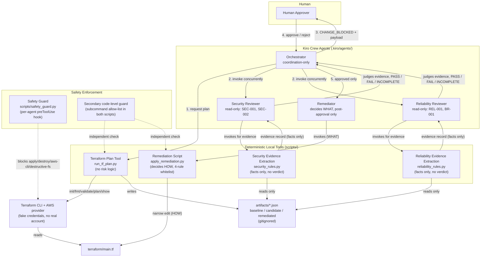

# Design Document: ChangeGuard AI (change-review)

## Overview

ChangeGuard AI is a Kiro Crew workflow that reviews a proposed change to `terraform/main.tf` against four deterministic rules (`SEC-001`, `SEC-002`, `REL-001`, `BR-001`) by diffing two or three genuine Terraform plan JSON artifacts. It never applies infrastructure, never calls AWS, and never lets an LLM edit HCL directly. It runs entirely on the Kiro Crew agent framework, the real Terraform CLI (with the AWS provider), the Python 3 standard library, and Git — nothing else (Requirement 1).

This design is intentionally narrow. It defines exactly four Kiro Crew agents (Orchestrator, Security Reviewer, Reliability Reviewer, Remediator), two deterministic local CLI scripts (`scripts/run_tf_plan.py`, `scripts/apply_remediation.py`), two deterministic evidence-extraction libraries invoked in-process by the reviewer agents (`scripts/security_rules.py`, `scripts/reliability_rules.py` — facts only, never a verdict), and one Kiro safety hook. No additional agents, rule IDs, cloud integrations, or infrastructure are introduced. Everything listed in the requirements document's "Out of Scope" section (IAM/S3/encryption analysis, OPA/Checkov/tfsec, GitHub PR automation, MCP servers, Bedrock, Lambda, ECS/RDS deployment, LocalStack, Docker, any frontend/database/telemetry) is a non-goal and does not appear anywhere below as an implemented capability.

Key design commitments carried through every section:

- **Two-plan evidence rule** (Requirement 3, steering doc "Evidence"): a finding is only ever produced by comparing the *after* values of two independently generated `terraform show -json` outputs — never by reading `terraform/main.tf` source, and never by reading the `before`/`after` diff *inside* a single plan (explained in detail in "Baseline/Candidate/Remediated Evidence Model" below).
- **Separation of coordination from rule logic** (Requirement 4.8): the Orchestrator never evaluates SEC-001/SEC-002/REL-001/BR-001 itself.
- **Separation of evidence from judgment** (Requirements 5.10, 5.11, 6.10, 6.11): the deterministic evidence-extraction libraries (`scripts/security_rules.py`, `scripts/reliability_rules.py`) only extract and validate facts from plan JSON — they never return `PASS`, `FAIL`, `INCOMPLETE`, a Finding, a severity, or a remediation decision. The Security Reviewer and Reliability Reviewer agents are the sole components that judge whether extracted evidence satisfies a rule and that produce the resulting `ReviewResult`.
- **Separation of decision from mechanism** (Requirement 9): the Remediator (an LLM-driven agent) decides *what* to fix; a deterministic, whitelisted Python script decides *how* to edit the file.
- **Human control** (Requirement 8, steering doc "Human control"): `terraform/main.tf` is never modified without an explicit human approval step.
- **Structural safety** (Requirement 11, steering doc "Safety"): `terraform apply`, `terraform destroy`, AWS CLI calls, and destructive filesystem operations are blocked by a Kiro hook and by a second, independent code-level guard.

## Architecture



Kiro-specific mapping:

- Security Reviewer, Reliability Reviewer, and Remediator are each defined as a separate Kiro CLI custom agent under `.kiro/agents/` (created during implementation, not in this design phase).
- **Orchestrator (revised — see "Kiro Crew 0.2.0 Orchestration Mapping" below):** the Orchestrator role is implemented as Kiro Crew's own `TaskRunner`, driven by a deterministic YAML DAG workflow file (`.kiro/crew/changeguard-workflow.yaml`), submitted to and executed under `kirocrew gateway`. No `.kiro/agents/orchestrator.json` is created — this design's original assumption that the Orchestrator would be a fourth Kiro CLI custom agent did not hold once the installed Kiro Crew 0.2.0 runtime was inspected directly; `TaskRunner` already *is* a coordination-only workflow engine, so a wrapping custom agent would add nothing except an untestable extra hop.
- `run_tf_plan.py` and `apply_remediation.py` are plain Python 3 stdlib scripts under `scripts/`, invoked by agents as tools — they contain no LLM calls and no rule logic.
- `security_rules.py` and `reliability_rules.py` are plain Python 3 stdlib evidence-extraction libraries under `scripts/`, invoked in-process by the Security Reviewer and Reliability Reviewer agents respectively. They contain no LLM calls and never return a verdict (`PASS`/`FAIL`/`INCOMPLETE`), a Finding, a severity, or a remediation decision — only a plain evidence record or an evidence-unavailable/malformed signal. The rule-satisfaction judgment and the resulting `ReviewResult` are produced by the agent itself.
- The Safety Guard is a Kiro `preToolUse` hook (`scripts/safety_guard.py`) embedded in the `hooks.preToolUse` field of each ChangeGuard agent's own JSON config under `.kiro/agents/` — the installed CLI version has no standalone `.kiro/hooks/` mechanism and no workspace-wide hook scope, so the guard is attached individually to every agent that holds a `shell` tool (see the discrepancy note in "Kiro Hook / Safety Strategy" below).
- `artifacts/` and `terraform/main.tf` are the only pieces of on-disk state the workflow reads or writes.

## End-to-End Workflow

```mermaid
sequenceDiagram
    participant Dev as Judge / Change Author
    participant O as Orchestrator
    participant PT as Terraform Plan Tool
    participant SR as Security Reviewer
    participant RR as Reliability Reviewer
    participant H as Human Approver
    participant RM as Remediator
    participant RS as Remediation Script

    Note over Dev,O: Phase 1 - Baseline evidence
    Dev->>O: Start ChangeGuard review
    O->>PT: run_tf_plan.py --terraform-dir terraform --output artifacts/baseline-plan.json
    PT->>PT: terraform init -input=false / fmt -check / validate / plan -refresh=false / show -json
    PT-->>O: baseline-plan.json written

    Note over Dev,O: Phase 2 - Candidate change
    Dev->>Dev: edit terraform/main.tf (one supported transition)
    O->>PT: run_tf_plan.py --terraform-dir terraform --output artifacts/candidate-plan.json
    PT-->>O: candidate-plan.json written

    Note over O,RR: Phase 3 - Independent parallel review
    par Security Reviewer
        O->>SR: evaluate(baseline-plan.json, candidate-plan.json)
        SR->>SR: invoke security_rules.py to extract evidence (facts only, no verdict)
        SR->>SR: judge whether evidence satisfies SEC-001 / SEC-002
        SR-->>O: PASS, or FAIL with SEC-001 / SEC-002 finding(s), or INCOMPLETE
    and Reliability Reviewer
        O->>RR: evaluate(baseline-plan.json, candidate-plan.json)
        RR->>RR: invoke reliability_rules.py to extract evidence (facts only, no verdict)
        RR->>RR: judge whether evidence satisfies REL-001 / BR-001
        RR-->>O: PASS, or FAIL with REL-001 / BR-001 finding(s), or INCOMPLETE
    end
    O->>O: aggregate (no rule evaluation performed here)

    alt one or more findings (FAIL) or any INCOMPLETE
        O->>H: CHANGE_BLOCKED { rule_id, severity, resource, baseline_value, candidate_value, reason, proposed_remediation }
        alt approved
            H->>O: approve
            O->>RM: delegate remediation (approved findings)
            RM->>RM: decide WHICH rule_id(s)/resource(s) to correct (WHAT)
            RM->>RS: apply_remediation.py --rule-id ... --resource ... --restore-value ...
            RS->>RS: whitelisted, narrow HCL edit (HOW)
            RS-->>RM: terraform/main.tf corrected
            O->>PT: run_tf_plan.py --terraform-dir terraform --output artifacts/remediated-plan.json
            PT-->>O: remediated-plan.json written
            par Security re-review
                O->>SR: evaluate(baseline-plan.json, remediated-plan.json)
                SR->>SR: extract evidence, then judge against SEC-001 / SEC-002
                SR-->>O: PASS / FAIL / INCOMPLETE
            and Reliability re-review
                O->>RR: evaluate(baseline-plan.json, remediated-plan.json)
                RR->>RR: extract evidence, then judge against REL-001 / BR-001
                RR-->>O: PASS / FAIL / INCOMPLETE
            end
            O->>Dev: SAFE_TO_SHIP only if both PASS and Terraform execution succeeded (scope caveat: 4 rules only); otherwise blocked
        else rejected
            H->>O: reject
            O->>Dev: REMEDIATION_REJECTED (terraform/main.tf left unmodified, Remediator never invoked)
        end
    else both PASS
        O->>Dev: SAFE_TO_SHIP (candidate as-is, scope caveat: 4 rules only)
    end
```

This diagram is the authoritative statement of control flow for Requirements 2–10 and 13.

## Baseline/Candidate/Remediated Evidence Model

### Why three artifacts, and why not a single plan's before/after

A freshly cloned repository has no `.tfstate`. Every `terraform plan` run in this workflow therefore plans a **create** action for each resource: `change.actions == ["create"]`, `change.before == null`, `change.after == <planned attributes>`. Because `before` is always `null` on a stateless clone, the `before`/`after` pair *inside one plan JSON file* carries no historical information — it cannot tell you what the configuration used to be. Relying on it would mean fabricating a "before" that Terraform never actually observed, which is exactly what Requirement 3 and the steering doc's "Evidence" principle forbid.

ChangeGuard works around this by never trusting a single plan's internal diff. Instead, it generates the **same kind of plan twice** (or three times) against two different versions of `terraform/main.tf`, and compares the `after` value of one plan against the `after` value of the other:

| Artifact | Generated from | Written to |
|---|---|---|
| Baseline Plan | the safe, unmodified `terraform/main.tf` | `artifacts/baseline-plan.json` |
| Candidate Plan | `terraform/main.tf` after the injected change | `artifacts/candidate-plan.json` |
| Remediated Plan | `terraform/main.tf` after approved, deterministic correction | `artifacts/remediated-plan.json` |

Every rule check compares **Baseline `after` vs. Candidate `after`** (pre-approval) or **Baseline `after` vs. Remediated `after`** (post-approval). Baseline is never compared to itself, and a plan's own `before` field is never read for rule evaluation.

### Generation commands (Terraform Plan Tool)

Both plan-generation calls (baseline and candidate/remediated) run the identical sequence against `terraform/main.tf`:

1. `terraform init -input=false`
2. `terraform fmt -check`
3. `terraform validate`
4. `terraform plan -refresh=false -out=<tmpfile>`
5. `terraform show -json <tmpfile>`

Step 5's stdout is written verbatim to the target artifact path. The tool performs no interpretation of the JSON — see "Terraform Plan Tool" below.

### JSON paths inspected per rule (evidence extraction, not rule evaluation)

The following specifications describe what **Evidence Extraction** does (`scripts/security_rules.py` for SEC-001/SEC-002, `scripts/reliability_rules.py` for REL-001/BR-001): reading the plan JSON's top-level `resource_changes` array (the standard `terraform show -json` schema), matching entries by `.address`, and reading only `.change.after` (never `.change.before`), to produce a plain evidence record. Extraction never decides `PASS`/`FAIL`/`INCOMPLETE` — it hands the extracted facts to the Security Reviewer or Reliability Reviewer agent, which is the sole component that judges whether the fact pattern satisfies the rule and produces the `Finding`/`ReviewResult` (Requirements 5.10, 5.11, 6.10, 6.11).

**SEC-001 — TCP/22 evidence**
- Resource: `resource_changes[] | select(.address == "aws_security_group.payments_sg")`
- Field extracted: `.change.after.ingress[]` — an array of ingress block objects, each with `.from_port`, `.to_port`, `.protocol`, `.cidr_blocks` (array of strings)
- Match rule for extraction: the ingress entry where `from_port <= 22 <= to_port` and `protocol` is `"tcp"` (or `"-1"`)
- Evidence record shape: `{resource: "aws_security_group.payments_sg", baseline: {cidr_blocks: [...]}, candidate: {cidr_blocks: [...]}}` (or an evidence-unavailable/malformed signal — see below)
- The fact pattern the Security Reviewer evaluates against SEC-001: in Baseline, the extracted entry's `cidr_blocks` does **not** contain `"0.0.0.0/0"`; in Candidate/Remediated, the corresponding entry's `cidr_blocks` **does** contain `"0.0.0.0/0"`. The Security Reviewer, not `security_rules.py`, decides whether this fact pattern constitutes a `FAIL`.

**SEC-002 — TCP/5432 evidence**
- Same resource and field path as SEC-001, but matching the ingress entry where `from_port <= 5432 <= to_port`
- Baseline symmetry: `terraform/main.tf`'s baseline configuration defines an explicit second ingress block for TCP/5432 (alongside the explicit TCP/22 block), so the Baseline Plan always contains an explicit ingress entry for port 5432 with `cidr_blocks == ["10.0.0.0/8"]` — this is not inferred or defaulted, it is read directly from the Baseline Plan's `.change.after.ingress[]`, symmetric with SEC-001. Because the baseline entry is explicit, remediation restores the exact baseline CIDR for either rule (the port-22 baseline CIDR for SEC-001, the port-5432 baseline CIDR for SEC-002) rather than inventing a value.
- Evidence record shape: `{resource: "aws_security_group.payments_sg", baseline: {cidr_blocks: [...]}, candidate: {cidr_blocks: [...]}}`, same shape as SEC-001, keyed to the port-5432 ingress entry
- The fact pattern the Security Reviewer evaluates against SEC-002: same condition as SEC-001, applied to port 5432 instead of port 22. The Security Reviewer, not `security_rules.py`, decides whether this fact pattern constitutes a `FAIL`.

**REL-001 — ECS desired_count evidence**
- Resource: `resource_changes[] | select(.address == "aws_ecs_service.payments_api")`
- Field extracted: `.change.after.desired_count` (integer)
- Evidence record shape: `{resource: "aws_ecs_service.payments_api", baseline: {desired_count: <int>}, candidate: {desired_count: <int>}}`
- The fact pattern the Reliability Reviewer evaluates against REL-001: Baseline `desired_count >= 3` and Candidate/Remediated `desired_count == 1`. The Reliability Reviewer, not `reliability_rules.py`, decides whether this fact pattern constitutes a `FAIL`.

**BR-001 — RDS deletion_protection evidence**
- Resource: `resource_changes[] | select(.address == "aws_db_instance.payments_db")`
- Field extracted: `.change.after.deletion_protection` (boolean)
- Evidence record shape: `{resource: "aws_db_instance.payments_db", baseline: {deletion_protection: <bool>}, candidate: {deletion_protection: <bool>}}`
- The fact pattern the Reliability Reviewer evaluates against BR-001: Baseline `deletion_protection == true` and Candidate/Remediated `deletion_protection == false`. The Reliability Reviewer, not `reliability_rules.py`, decides whether this fact pattern constitutes a `FAIL`.

For every rule, if the resource address is missing from either plan, if the field is absent or not the expected type, or if the ingress array has no entry covering the relevant port, `security_rules.py`/`reliability_rules.py` returns an evidence-unavailable/malformed signal rather than a fabricated evidence record. The calling Reviewer Agent treats that signal as insufficient evidence and returns `INCOMPLETE` for that rule (Requirements 3.3, 5.6, 5.9, 6.6, 6.9) — never a silent `PASS` and never a fabricated `FAIL`.

## Components and Interfaces

### Orchestrator (Kiro Crew `TaskRunner`, driven by a YAML DAG — coordination-only)

- **Role**: drives the workflow shown in the sequence diagram above: requests plan generation, invokes both reviewers, aggregates their results, runs the human approval gate, delegates remediation, triggers post-remediation verification, and emits the final verdict.
- **Implementation (revised from this design's original assumption — see "Kiro Crew 0.2.0 Orchestration Mapping" below):** the Orchestrator is **not** a fourth Kiro CLI custom agent under `.kiro/agents/`. It is Kiro Crew's own `TaskRunner`, driven by a deterministic YAML DAG workflow file (`.kiro/crew/changeguard-workflow.yaml`), decomposed with no LLM involvement and executed under `kirocrew gateway`. Every responsibility listed below is carried out either by `TaskRunner`'s own DAG-execution engine (sequencing, dependency resolution, concurrent batching, failure propagation) or by thin, policy-free Python transport scripts a DAG node's `shell:` command invokes (`scripts/run_agent_and_save.py`, `scripts/aggregate_review.py`, `scripts/run_remediation_stage.py`, `scripts/final_verdict.py`) — never by a Kiro CLI agent's own LLM reasoning, so "coordination-only" is enforced structurally (there is no prompt for a rule-judgment instruction to leak into) rather than only by written policy as with the three LLM-driven agents.
- **Allowed inputs**: reviewer `ReviewResult`s (`PASS`, `FAIL` with findings, or `INCOMPLETE`), human approval/rejection decision (via the DAG's `force_approval` gate on the `remediation` node), Terraform Plan Tool success/failure status.
- **Allowed outputs**: invocations of the Terraform Plan Tool, invocations of Security Reviewer / Reliability Reviewer / Remediator, the `CHANGE_BLOCKED` / `SAFE_TO_SHIP` / `REMEDIATION_REJECTED` payloads presented to the human.
- **Permission boundary**: coordination-only. It never reads plan JSON to make a rule decision, never writes to `terraform/main.tf`, and never invokes `apply_remediation.py` directly (Requirement 4.8). It is the only path allowed to invoke the Remediator, and only after the DAG's `force_approval` gate on the `remediation` node has been explicitly approved.

### Kiro Crew 0.2.0 Orchestration Mapping

This subsection documents the confirmed, empirically-verified behavior of the actually-installed `kirocrew` 0.2.0 pipx package that the Orchestrator's implementation is built against, superseding this design's original (pre-inspection) assumption of a `.kiro/agents/orchestrator.json` Kiro CLI agent.

> **Architecture statement (established by a live semantics probe, not by static source inspection alone):** Kiro Crew 0.2.0 executes every DAG task through an LLM/ACP agent session. ChangeGuard therefore does not claim deterministic task execution by Crew. The DAG structure, deterministic Python tools, artifact validation, permission boundaries, and approval gate provide the workflow's reproducibility and fail-closed safety — not any claim that Crew itself runs a node's command text as a literal subprocess. This was confirmed empirically (not merely inferred from reading `task_planner.py`/`task_executor.py`): a disposable probe YAML node (`shell: "printf ... > /tmp/probe.txt"`) was planned and executed against a real running `kirocrew gateway --test-mode`. The planned `Task` object had no `shell`/`command` field at all — only `description` (the `shell:` text folded verbatim into prose), confirming `decompose_yaml()`'s behavior. Executing it spawned a real `kiro-cli acp --agent kirocrew-lite` child process (confirmed via `ps aux`) and consumed real LLM tokens (`tokens_used` climbed from `0` to `17` and stalled there, pending an unresolved tool-permission prompt) — the probe file was never created, and the task never completed. This is conclusive: there is no code path in `task_executor.py`/`taskrunner.py` that runs a node's `shell:`/`prompt:` text as a literal, deterministic subprocess; every node, regardless of which YAML key it uses, is one LLM chat turn against the run's single per-run agent.
>
> This finding does **not** invalidate Crew as ChangeGuard's orchestration/scheduling/approval engine — `decompose_yaml()`'s dependency-DAG parsing, `group_parallel_tasks()`/`asyncio.gather()` concurrency, and the Gateway's `force_approval` approval gate are all still genuine and still confirmed (see items 5–9 below). Only the claim that a node's command text is executed *deterministically by Crew itself* is corrected here. ChangeGuard's actual safety model is: **deterministic tools executed through constrained LLM-mediated Crew tasks** — every DAG task runs inside a single, extremely narrow, permission-restricted Kiro CLI agent (`crew-runner`, below) whose only capability is to run one of a fixed handful of deterministic Python transport/tool scripts, with fail-closed artifact validation at every hand-off.

1. **Deterministic, LLM-free *decomposition* for YAML specs — but LLM-*mediated execution* of the resulting tasks.** `kirocrew run <spec>` normally decomposes a Markdown spec via an LLM. When the spec is a YAML file (or `source="yaml"`), `decompose_yaml()` (`kiro_crew/task_planner.py`) parses it **deterministically** into a `Task` DAG with no LLM call at all — the schema is a top-level `agents:` mapping whose nodes accept **exactly** `{agent, timeout, depends_on, description, prompt, shell}` (any other key raises `ValueError`), and `depends_on` references other node names by string, not by index. This determinism is real, but it applies only to *building the DAG's structure* — not to *running* each resulting `Task`. Confirmed by the live probe above: whichever of `prompt:`/`shell:` is used, its text is folded verbatim into `Task.description`, and every task is executed as one LLM/ACP chat turn (`task_executor.py::execute_task()` → `client.stream(full_prompt)`) against the run's single per-run agent — never as a literal subprocess. This is why the Orchestrator's workflow logic lives in a YAML file (`.kiro/crew/changeguard-workflow.yaml`/`.kiro/crew/changeguard-workflow-remediation.yaml`), not a Markdown spec: only the YAML path guarantees the *DAG structure itself* is never subject to LLM interpretation — the *execution* of each node still is, and ChangeGuard's safety model accounts for that (see the architecture statement above).
2. **`agent:` is a cosmetic label, not an executor binding.** The `agent:` value inside a YAML node is embedded verbatim into the decomposed `Task.description` text; it is never used to select or invoke an actual Kiro CLI custom agent (confirmed live: an `agent: probe` value that is not even a registered Crew agent name produced no error, just descriptive text). There is no per-node field in this schema for binding a node to an executable agent. The *only* real agent-selection knob is `TaskRunner`'s single, run-scoped `self._agent`, supplied once via the `agent` field on the `POST /api/taskrunner/plan` and `POST /api/taskrunner/{task_id}/execute` request bodies — every task in one run shares that one agent.
3. **A single, narrow, run-scoped Kiro CLI agent (`crew-runner`) is what actually executes every DAG task's named command.** Because every task is an LLM chat turn against the run's one per-run agent, ChangeGuard defines `.kiro/agents/crew-runner.json` (prompt: `.kiro/agents/crew-runner-prompt.md`) specifically for this role: a restricted execution agent whose only tool is `shell`, whose `permissions.rules` allow-list names only the exact ChangeGuard transport scripts (`run_tf_plan.py`, `run_agent_and_save.py`, `aggregate_review.py`, `run_remediation_stage.py`, `final_verdict.py`, `cleanup_run_artifacts.py`, and the one baseline-existence check), and which explicitly denies `apply_remediation.py` (remediation only ever reaches that script via `run_remediation_stage.py` → the `remediator` agent, never directly). `scripts/changeguard_launch.py` supplies `agent: crew-runner` explicitly on every plan/execute call — ChangeGuard never relies on Crew's default `kirocrew-lite` persona. Each DAG node's `prompt:` text (not `shell:` — see item 4) explicitly instructs `crew-runner` to "Execute exactly this command and no other command: `<command>`," keeping the named command fixed and non-interpolated; `crew-runner` itself invokes `security-reviewer`/`reliability-reviewer`/`remediator` only indirectly, by running `run_agent_and_save.py --agent <name>` or `run_remediation_stage.py`, which in turn invoke those specialized Kiro CLI agents via `kiro-cli chat --agent <name> --no-interactive "<prompt>"` as their own subprocess call.
4. **The YAML DAG files use `prompt:`, not `shell:`, and DAG data flow is file-based, never automatic result-injection.** `decompose_yaml()` folds `prompt:`/`shell:` identically into `Task.description` (confirmed live — see the architecture statement above), so ChangeGuard's DAG files use `prompt:` exclusively; using `shell:` would misleadingly suggest Crew executes that text as a literal command. Separately: a completed task's `Task.result` (its LLM output text) is **never** automatically injected into a dependent node's prompt — `build_task_prompt()` (`kiro_crew/task_executor.py`) only ever shows the plan's titles/descriptions/dependency graph to a subsequent task, never a predecessor's `.result` text. The only working data-flow channel between nodes in one `TaskRunner.run()` invocation is the shared filesystem (every task shares one `run.work_dir`). Consequently, every node that produces structured output writes it to a fixed, explicitly-named JSON artifact path, and every dependent node's prompt/shell command is told to read that exact path — see the fixed artifact paths enumerated in the YAML file's own header comment and reproduced here: `artifacts/candidate-plan.json`, `artifacts/security-review-result.json`, `artifacts/reliability-review-result.json`, `artifacts/change-blocked-result.json`, `artifacts/remediation-result.json`, `artifacts/remediated-plan.json`, `artifacts/security-remediated-review-result.json`, `artifacts/reliability-remediated-review-result.json`, and `artifacts/final-verdict.json` (in addition to the pre-existing `artifacts/baseline-plan.json`, which this workflow only ever reads, never generates).
5. **`decompose_yaml()` has no conditional/branching primitive, so ChangeGuard uses a two-stage Crew lifecycle, not one unconditional DAG.** Every node in one YAML file's DAG always runs once its `depends_on` are satisfied — there is no per-node "skip if a predecessor's data outcome was X" key in the allowed schema. A single-file DAG containing both review and remediation nodes would therefore force a fully safe (PASS+PASS) candidate to still reach the `remediation` node and its approval gate, which Requirement 4.4/8.4 forbid. ChangeGuard resolves this by splitting the DAG into two separate YAML files: **Stage A**, `.kiro/crew/changeguard-workflow.yaml` (`candidate-plan` → `{security-review, reliability-review}` → `aggregate-review`), and **Stage B**, `.kiro/crew/changeguard-workflow-remediation.yaml` (`remediation` → `remediated-plan` → `{security-re-review, reliability-re-review}` → `final-verdict`). `scripts/changeguard_launch.py` plans and executes Stage A unconditionally, then inspects Stage A's own filesystem output — whether `artifacts/change-blocked-result.json` exists — to decide, entirely outside of Crew's own DAG/API semantics, whether Stage B is planned at all. A safe candidate never has a `remediation` `Task` object decomposed in the first place, so there is nothing for `force_approval` to gate and nothing for a human to approve.
6. **The human approval gate is a real `Task` field, but is not settable from YAML, and must be verified before execution starts.** `force_approval` (`kiro_crew/task_models.py::Task`) hard-blocks execution until a human approves via a real Gateway-backed `dashboard_state.request_approval()` call (an `asyncio.Future`, broadcast over websocket, resolved via `POST /api/approvals/{id}/{action}`). `decompose_yaml()` does **not** accept `force_approval` as a YAML key. The confirmed, safe REST sequence for Stage B is: `POST /api/taskrunner/plan` (`source: yaml`; decomposes into `status == "planned"` **without** starting execution — this is a different, non-executing endpoint from the combined `POST /api/taskrunner`, which starts running immediately on submission and must never be used for Stage B) → locate the `remediation` task by name in the response's `steps[]` → `PATCH /api/taskrunner/{task_id}/tasks/{index}` (`api_taskrunner_update_task` → `TaskRunner.update_task`) with `{"force_approval": true}` → **verify** the response's `force_approval` field is exactly `true` → only then `POST /api/taskrunner/{task_id}/execute` to start it. `scripts/changeguard_launch.py` implements exactly this ordering and fails closed (non-zero exit, execute never called) if planning fails, the response has no usable `task_id`, zero or more than one task matches the `remediation` node name, the update call fails, or the update response does not confirm `force_approval == true`.
7. **A genuine blocking approval gate requires a running gateway with an approval handler wired up.** Bare `kirocrew run TASK.md` never wires an approval handler (`cli_server.py::_run_task` constructs its `TaskRunner` with no `on_approval`/`on_tool_approval` args) — a `force_approval` task under bare `run` fails immediately with "no approval handler configured"; it does not auto-proceed and does not silently skip the gate. A real, visible, blocking human approval step requires `kirocrew gateway --approval interactive` (or equivalent) to already be running, with Stage B submitted through the plan/update/verify/execute sequence above against that gateway's REST API, so `slack/gateway.py`'s `_task_approval()` handler (wired only there) is active.
8. **Rejection maps to `REMEDIATION_REJECTED` without any Crew-internal change.** Denying a `force_approval` task sets `run.status = "failed"` and `task.error = "user denied force_approval gate"`. This is documented and mapped as ChangeGuard's `REMEDIATION_REJECTED` outcome (Requirement 8.5, 8.6) at the interpretation layer only — Crew's own internals are left untouched.
9. **Parallel reviewer execution (Requirement 7) is genuine, not simulated.** `group_parallel_tasks()` buckets ready tasks by `depends_on` closure, and `TaskRunner.run()` dispatches each ready batch via real `asyncio.gather()` bounded by a semaphore (`taskrunner.py`, `run()`'s ready-batch dispatch loop). The `security-review`/`reliability-review` node pair (Stage A) and, symmetrically, `security-re-review`/`reliability-re-review` (Stage B) share the same `depends_on` set and have no dependency on each other, so they land in the same ready batch and execute concurrently under Crew's own scheduler — this is what satisfies Requirement 7.2 ("WHERE Kiro Crew parallel execution primitives are available... invoke... concurrently") for the Orchestrator's implementation, distinct from the informal "independent calls in the same turn" framing used for the Kiro CLI agent tool-call pattern elsewhere in this document.
10. **Run-specific artifacts are cleaned up only at the start of a fresh Stage A run, never before Stage B.** `scripts/cleanup_run_artifacts.py` removes exactly the run-specific `artifacts/*.json` files (never `artifacts/baseline-plan.json`, which is intentionally persistent) via an explicit filename allow-list and `os.remove` only — no recursive deletion, no shell `rm`. `scripts/changeguard_launch.py` runs this cleanup before planning Stage A, but deliberately not before Stage B, since Stage B must read the very `artifacts/change-blocked-result.json` Stage A just produced. `scripts/aggregate_review.py`'s own PASS branch additionally removes any pre-existing `artifacts/change-blocked-result.json` itself, as a second, independent layer of the same stale-artifact protection — a safe candidate must never let a previous run's blocked result be mistaken for its own outcome.

No `.kiro/agents/orchestrator.json` exists anywhere in this implementation; every "Orchestrator" responsibility named in requirements.md's glossary is satisfied by some combination of the two-stage YAML DAG structure, Crew's own `TaskRunner` plan/update/execute REST mechanism, the run-scoped `crew-runner` execution agent, and the policy-free transport scripts named above.

### Security Reviewer (Kiro Crew agent — read-only)

- **Role**: the LLM-driven agent that determines whether deterministically extracted evidence satisfies SEC-001 or SEC-002, and produces the resulting `ReviewResult`. It invokes the `security_rules.py` evidence-extraction library to obtain a plain evidence record for each rule (see "JSON paths inspected per rule" above), then judges — itself, not the library — whether that evidence's fact pattern satisfies SEC-001 or SEC-002. The Security Reviewer is the only component authorized to decide `PASS`, `FAIL`, or `INCOMPLETE`, or to produce a finding, for SEC-001 or SEC-002 (Requirement 5.11); deterministic code never makes this decision (Requirement 5.10).
- **Allowed inputs**: paths to exactly two plan JSON artifacts (Baseline + Candidate, or Baseline + Remediated), supplied by the Orchestrator. The Security Reviewer passes these paths to `security_rules.py` and receives back, per rule, either a plain evidence record (e.g. `{resource: str, baseline: {cidr_blocks: [...]}, candidate: {cidr_blocks: [...]}}`) or an evidence-unavailable/malformed signal — never a verdict.
- **Allowed outputs**: a `ReviewResult` with `status ∈ {PASS, FAIL, INCOMPLETE}` (Requirements 5.7, 5.8, 5.9) and, when `status` is `FAIL`, a list of one or more findings, each shaped as the `CHANGE_BLOCKED` finding record (see "Human Approval Gate" below), restricted to `rule_id ∈ {SEC-001, SEC-002}`.
- **Permission boundary**: read-only. It cannot write any file, cannot execute `apply_remediation.py` or any Terraform command, and cannot report any security observation outside SEC-001/SEC-002 (Requirement 5). It may only invoke `security_rules.py` for evidence extraction — that library itself cannot write any file or return a verdict. If evidence extraction returns an evidence-unavailable/malformed signal for SEC-001 or SEC-002, or if the Security Reviewer's own judgment step fails to complete (exception, timeout, malformed input encountered mid-check), it must return `INCOMPLETE` and must not emit a finding — or a `PASS` — for the rule that didn't finish (Requirement 5.9) — see "Error Handling."

### Reliability Reviewer (Kiro Crew agent — read-only)

- **Role**: the LLM-driven agent that determines whether deterministically extracted evidence satisfies REL-001 or BR-001, and produces the resulting `ReviewResult`. It invokes the `reliability_rules.py` evidence-extraction library to obtain a plain evidence record for each rule (see "JSON paths inspected per rule" above), then judges — itself, not the library — whether that evidence's fact pattern satisfies REL-001 or BR-001. The Reliability Reviewer is the only component authorized to decide `PASS`, `FAIL`, or `INCOMPLETE`, or to produce a finding, for REL-001 or BR-001 (Requirement 6.11); deterministic code never makes this decision (Requirement 6.10).
- **Allowed inputs**: the same two-artifact-path input shape as the Security Reviewer. The Reliability Reviewer passes these paths to `reliability_rules.py` and receives back, per rule, either a plain evidence record (e.g. `{resource: str, baseline: {desired_count: <int>}, candidate: {desired_count: <int>}}`) or an evidence-unavailable/malformed signal — never a verdict.
- **Allowed outputs**: a `ReviewResult` with `status ∈ {PASS, FAIL, INCOMPLETE}` (Requirements 6.7, 6.8, 6.9) and, when `status` is `FAIL`, a list of one or more findings restricted to `rule_id ∈ {REL-001, BR-001}`.
- **Permission boundary**: read-only, identical constraints to the Security Reviewer, plus: it may only invoke `reliability_rules.py` for evidence extraction — that library itself cannot write any file or return a verdict. If evidence extraction returns an evidence-unavailable/malformed signal for REL-001 or BR-001, or if the Reliability Reviewer's own judgment step fails to complete (exception, timeout, malformed input encountered mid-check), it must return `INCOMPLETE` and must not emit a finding — or a `PASS` — for the rule that didn't finish (Requirement 6.9) — see "Error Handling."

### Security/Reliability Evidence Extraction — `scripts/security_rules.py` / `scripts/reliability_rules.py`

- **Role**: plain, directly-importable Python 3 stdlib libraries (not CLI tools) invoked in-process by the Security Reviewer and Reliability Reviewer respectively. Each performs the JSON-path reads and type/presence checks described in "JSON paths inspected per rule" above and returns, per rule, a plain evidence record or an evidence-unavailable/malformed signal.
- **Allowed inputs**: paths to two plan JSON artifacts (Baseline + Candidate, or Baseline + Remediated), and the rule ID(s) to extract evidence for.
- **Allowed outputs**: a plain evidence record shaped as `{resource: str, baseline: {<field>: value}, candidate: {<field>: value}}`, or an evidence-unavailable/malformed signal when the resource address, field, or expected type is not present. It never returns `PASS`, `FAIL`, `INCOMPLETE`, a `Finding`, a severity, or a remediation decision (Requirements 5.10, 6.10) — the calling Reviewer Agent is solely responsible for judging the evidence and producing the `ReviewResult`.
- **Permission boundary**: read-only, in-process library code, no file-write capability, no verdict-producing capability. This is what allows the Security Reviewer / Reliability Reviewer agents to remain the sole deciders of `PASS`/`FAIL`/`INCOMPLETE` for their respective rules.

### Remediator (Kiro Crew agent — post-approval only, decides WHAT)

- **Role**: after the Orchestrator delegates an *approved* set of findings, determines which supported `rule_id` and `resource` each approved finding maps to, and what the correct restore value is (always the Baseline value recorded in that finding — remediation restores the safe baseline behavior, never an arbitrary value).
- **Allowed inputs**: the approved finding record(s) only (never raw plan JSON, never `terraform/main.tf` directly).
- **Allowed outputs**: exactly one `apply_remediation.py` invocation per approved finding, passing `--rule-id`, `--resource`, and `--restore-value` taken from the finding's `baseline_value`.
- **Permission boundary**: can-invoke-script, not can-write-file. It never opens or edits `terraform/main.tf` itself (Requirement 9.4) — all HCL mutation happens inside the whitelisted script. It cannot be invoked before human approval (Requirement 9.6), and it must refuse (block, not guess) any finding whose `rule_id` is outside `{SEC-001, SEC-002, REL-001, BR-001}` (Requirement 9.7).

### Parallel Reviewer Execution

Security Reviewer and Reliability Reviewer are modeled as two independent Kiro Crew agent invocations issued by the Orchestrator within the same orchestration step. Each invocation:

- receives only the two artifact file paths for that comparison cycle as input (no shared mutable state, no reference to the other reviewer's invocation or result);
- runs to completion and returns a self-contained `ReviewResult` (`PASS`, `FAIL` with findings, or `INCOMPLETE`) with no ordering dependency on the other reviewer.

Because there is no data dependency between the two calls, the Orchestrator issues them as independent, concurrently-invokable Kiro Crew agent tasks in the same turn — the same "independent calls with no dependency between them run together" pattern Kiro Crew uses for any set of unrelated agent/tool invocations — rather than sequentially awaiting one before starting the other. This satisfies Requirement 7: neither reviewer's finding set is computed from, or gated on, the other reviewer's finding set. The Orchestrator's aggregation step is a pure union of the two independently-returned finding lists; it performs no rule logic of its own (Requirement 4.3, 4.8).

### Human Approval Gate

- **Where it pauses**: immediately after the Orchestrator aggregates one or more findings from the parallel review of Baseline vs. Candidate. The workflow stops *before* the Remediator is invoked and *before* `terraform/main.tf` is touched (Requirement 8.4, 4.4).
- **`CHANGE_BLOCKED` payload** presented to the Human Approver — one record per finding:

  | Field | Description |
  |---|---|
  | `rule_id` | `SEC-001` \| `SEC-002` \| `REL-001` \| `BR-001` |
  | `severity` | Fixed per rule per Requirement 8.3: SEC-001 = `CRITICAL`, SEC-002 = `CRITICAL`, REL-001 = `HIGH`, BR-001 = `CRITICAL` |
  | `resource` | Terraform resource address, e.g. `aws_security_group.payments_sg` |
  | `baseline_value` | Value read from `artifacts/baseline-plan.json` at the JSON path for that rule |
  | `candidate_value` | Value read from `artifacts/candidate-plan.json` at the same path |
  | `reason` | Human-readable statement of the rule violated, e.g. "TCP/22 ingress became public via 0.0.0.0/0" |
  | `proposed_remediation` | The restore action, e.g. "Restore `cidr_blocks` on the port-22 ingress rule of `aws_security_group.payments_sg` to `baseline_value`" |

- **Capturing the decision**: the Human Approver responds with an explicit approve or reject signal for the presented `CHANGE_BLOCKED` payload (the concrete UI/CLI mechanism for capturing this signal is an implementation detail for the tasks phase; the design constraint is that it must be an explicit, out-of-band human action, not an inferred or default agent decision).
- **Approved path**: Orchestrator invokes the Remediator with the approved finding(s); Remediator invokes `apply_remediation.py`; a fresh Remediated Plan is generated and re-reviewed; Orchestrator reports `SAFE_TO_SHIP` only if the Terraform plan execution for the Remediated Plan succeeded AND both the Security Reviewer and the Reliability Reviewer return `PASS` on that re-review (Requirement 10.3). A `FAIL` from either reviewer, an `INCOMPLETE` from either reviewer, or any tool/evidence-generation error independently blocks `SAFE_TO_SHIP` (Requirement 10.3, 10.4, 10.5, 10.6).
- **Rejected path**: Orchestrator reports `REMEDIATION_REJECTED`, leaves `terraform/main.tf` unmodified, and never invokes the Remediator (Requirement 8.5, 8.6). The workflow stops there — there is no retry loop implied by this design.

### Terraform Plan Tool — `scripts/run_tf_plan.py`

- **CLI contract**: `python3 scripts/run_tf_plan.py --terraform-dir <path> --output <path>`
- **Behavior**: runs, in order, `terraform init -input=false`, `terraform fmt -check`, `terraform validate`, `terraform plan -refresh=false -out=<tmp>`, `terraform show -json <tmp>` against `--terraform-dir`, and writes the final command's stdout byte-for-byte to `--output`. Each subprocess call uses an argv list (never a shell string), and the subcommand (`init`/`fmt`/`validate`/`plan`/`show`) is checked against a fixed allow-list before invocation — this is the "secondary enforcement" guard referenced in Requirement 11.6 and detailed under "Kiro Hook / Safety Strategy."
- **Explicitly excluded**: any risk-detection or rule-evaluation logic (Requirement 2.3); any `terraform apply` or `terraform destroy` invocation, under any argument combination (Requirement 2.4) — these subcommands are simply not in the tool's allow-list, so there is no code path that can reach them.

### Remediation Script — `scripts/apply_remediation.py`

- **CLI contract**: `python3 scripts/apply_remediation.py --terraform-dir <path> --rule-id <SEC-001|SEC-002|REL-001|BR-001> --resource <address> --restore-value <value>`
- **Behavior**: looks up `--rule-id` in a fixed 4-entry whitelist mapping `rule_id → (expected resource type, expected HCL attribute/block, value type)`. If `--rule-id` is not one of the four supported IDs, or `--resource` does not match the expected resource type/address for that rule, the script exits non-zero and writes nothing (Requirement 9.7's script-level backstop). If it matches, the script performs one narrowly scoped, targeted edit to `terraform/main.tf` — e.g. rewriting the `cidr_blocks` list on the matched port-22 ingress block (SEC-001), the `cidr_blocks` list on the matched port-5432 ingress block (SEC-002), the `desired_count` value, or the `deletion_protection` value — and nothing else in the file. For SEC-002, the restore target is the existing baseline port-5432 ingress entry's `cidr_blocks` value (`["10.0.0.0/8"]`, already present in `terraform/main.tf`'s explicit second ingress block) — the script restores that exact baseline CIDR, symmetric with SEC-001, never a newly invented value.
- **Explicitly excluded**: any generic "write these bytes to this path" capability (Requirement 9.5). The script has no file-path argument other than `--terraform-dir`, and no free-form content argument other than the single, type-checked `--restore-value` for the one whitelisted attribute the given `--rule-id` is allowed to touch.
- **WHAT vs. HOW split**: the Remediator (LLM agent) decides *which* finding to act on and *what* the restore value should be (always sourced from that finding's recorded `baseline_value`, never invented). The script decides *how* the edit is mechanically performed — the exact text/AST manipulation of `terraform/main.tf` — and independently validates that the requested value is of the correct type for the rule (int for REL-001, bool for BR-001, a CIDR-list string for SEC-001/SEC-002) before writing.

## Data Models

All data ChangeGuard passes between components is plain JSON (plan artifacts) or plain in-memory records (finding payloads) — there is no database and no persisted schema beyond the three artifact files.

### Terraform Plan JSON (`baseline-plan.json` / `candidate-plan.json` / `remediated-plan.json`)

Standard `terraform show -json` output, unmodified. The fields ChangeGuard relies on:

```text
{
  "resource_changes": [
    {
      "address": "aws_security_group.payments_sg",
      "type": "aws_security_group",
      "change": {
        "actions": ["create"],
        "before": null,
        "after": {
          "ingress": [
            { "from_port": 22, "to_port": 22, "protocol": "tcp", "cidr_blocks": ["10.0.0.0/8"] },
            { "from_port": 5432, "to_port": 5432, "protocol": "tcp", "cidr_blocks": ["10.0.0.0/8"] }
          ]
        }
      }
    },
    {
      "address": "aws_ecs_service.payments_api",
      "type": "aws_ecs_service",
      "change": { "actions": ["create"], "before": null, "after": { "desired_count": 3 } }
    },
    {
      "address": "aws_db_instance.payments_db",
      "type": "aws_db_instance",
      "change": { "actions": ["create"], "before": null, "after": { "deletion_protection": true } }
    }
  ]
}
```

ChangeGuard treats this structure as read-only, third-party-owned data (produced by the real Terraform binary) and never edits or fabricates it. Only `resource_changes[].address` and `resource_changes[].change.after.*` are read, per the JSON paths defined in "Baseline/Candidate/Remediated Evidence Model."

### Finding record (internal — Reviewer → Orchestrator)

Each reviewer returns a list of zero or more records of this shape (this is also the basis of the `CHANGE_BLOCKED` payload field table in "Human Approval Gate"):

```text
Finding {
  rule_id: "SEC-001" | "SEC-002" | "REL-001" | "BR-001"
  severity: "CRITICAL" | "HIGH"   # per Requirement 8.3: SEC-001/SEC-002/BR-001 = CRITICAL, REL-001 = HIGH
  resource: str            # Terraform resource address
  baseline_value: <str | int | bool>
  candidate_value: <str | int | bool>   # or remediated_value, on the post-remediation cycle
  reason: str
  proposed_remediation: str
}
```

`baseline_value`/`candidate_value` types follow the field they were read from: a CIDR string list summary for SEC-001/SEC-002, an int for REL-001, a bool for BR-001.

### Reviewer result (internal — Reviewer → Orchestrator)

```text
ReviewResult {
  status: "PASS" | "FAIL" | "INCOMPLETE"
  findings: list[Finding]     # empty when status is PASS or INCOMPLETE
}
```

Both the Security Reviewer and the Reliability Reviewer return this same three-way `ReviewResult`: `PASS` when evaluation completes and no supported finding was identified (Requirements 5.7, 6.7), `FAIL` when evaluation completes and a supported finding was identified (Requirements 5.8, 6.8), or `INCOMPLETE` when the reviewer could not complete the required evaluation of one of its two rules (Requirements 5.9, 6.9). `INCOMPLETE` is distinct from `PASS` so the Orchestrator never treats a failed evaluation as evidence of safety.

### Remediation invocation record (internal — Remediator → Remediation Script, via CLI args)

```text
RemediationRequest {
  rule_id: "SEC-001" | "SEC-002" | "REL-001" | "BR-001"   # whitelist-checked by the script
  resource: str
  restore_value: <str | int | bool>   # always sourced from the approved finding's baseline_value
}
```

## Correctness Properties

*A property is a characteristic or behavior that should hold true across all valid executions of a system — a formal statement about what the system should do. Properties serve as the bridge between human-readable specifications and machine-verifiable correctness guarantees.*

This design does not use a generator/shrinking property-based testing (PBT) library (e.g. Hypothesis for Python). Requirement 1.4 forbids any Python dependency outside the standard library, and Requirement 12.1 mandates the `unittest` module specifically — no mainstream PBT library ships in the standard library, so adopting one would violate both constraints. That reasoning does not, however, mean the design has no formal correctness properties. A correctness property is simply a formal, testable statement about system behavior; it does not require a generator/shrinking library to state or to check. The properties below are derived directly from requirements.md and are each verified through the existing stdlib example-based/fixture tests described in "Testing Strategy" — using hand-constructed representative cases, not generated/PBT-style random inputs.

### Property 1: Two-genuine-plan evidence requirement

For all findings reported by the ChangeGuard System, the finding is derived only from comparing the `.change.after` values of two genuine Terraform plan JSON artifacts (Baseline vs. Candidate, or Baseline vs. Remediated); no finding is ever derived from Terraform source code alone, and no finding is ever derived from the `before`/`after` fields within a single plan. Insufficient evidence (a missing resource address, an absent or malformed field, or an ingress array with no entry covering the relevant port) is distinct from the absence of a finding: it is reported as `INCOMPLETE`, never conflated with a `PASS` and never fabricated into a `FAIL`.

**Validates: Requirements 3.1, 3.2, 3.3, 3.4, 5.6, 5.9, 6.6, 6.9**

Verified by: `test_security_reviewer.py`, `test_reliability_reviewer.py`, `test_baseline_pass.py` — each fixture-based test supplies exactly two hand-constructed plan JSON files (baseline + candidate) and asserts on the resulting finding/PASS/INCOMPLETE status; no test path evaluates a finding from `terraform/main.tf` source or from a single plan's own `before`/`after` pair; a dedicated malformed/missing-field fixture asserts `INCOMPLETE` rather than `PASS` or a fabricated finding.

### Property 2: Reviewer output scope restriction

For all findings returned by the Security Reviewer, `rule_id ∈ {SEC-001, SEC-002}`. For all findings returned by the Reliability Reviewer, `rule_id ∈ {REL-001, BR-001}`. In both cases, the `rule_id`-scoped judgment (PASS/FAIL/INCOMPLETE) is made by the Reviewer Agent itself from an evidence record supplied by `security_rules.py`/`reliability_rules.py`; the evidence-extraction library never returns a finding, a severity, or a verdict of its own.

**Validates: Requirements 5.1, 5.5, 5.10, 5.11, 6.1, 6.5, 6.10, 6.11**

Verified by: `test_security_reviewer.py` (asserts every returned finding's `rule_id` is `SEC-001` or `SEC-002` across the SEC-001, SEC-002, and safe fixtures, and that `security_rules.py`'s extraction functions return only evidence records/unavailable-signals, never a status), `test_reliability_reviewer.py` (same, for `rule_id ∈ {REL-001, BR-001}` and `reliability_rules.py`).

### Property 3: No modification without prior human approval

For all executions of the ChangeGuard workflow, `terraform/main.tf` is modified only after an explicit human approval signal has been recorded for the finding(s) being remediated; the rejected path and the no-finding path leave `terraform/main.tf` unmodified.

**Validates: Requirements 8.4, 8.5, 8.6, 9.6**

Verified by: `test_remediation_script.py`, which exercises `apply_remediation.py` only along the approved-remediation call path (the script is the sole code path capable of writing `terraform/main.tf`, and the test suite contains no call to it outside that path); the rejected/no-finding branches are confirmed by inspection of the Orchestrator's control flow, which contains no invocation of the Remediator prior to approval.

### Property 4: Remediation script rule-ID whitelist enforcement

For all invocations of `apply_remediation.py`, the script performs a file write only when `--rule-id` is one of `{SEC-001, SEC-002, REL-001, BR-001}` and `--resource` matches that rule's expected resource type/address; for any other `--rule-id` value, the script exits non-zero and writes nothing.

**Validates: Requirements 9.3, 9.5, 9.7**

Verified by: `test_remediation_script.py`, which asserts a successful, narrowly-scoped edit for each of the four supported rule IDs and asserts a non-zero exit with no file modification for an unsupported `--rule-id` value.

### Property 5: SAFE_TO_SHIP requires successful execution and dual PASS on the same evidence pair

For all final verdicts of `SAFE_TO_SHIP`, the relevant Terraform plan execution succeeded and both the Security Reviewer and the Reliability Reviewer returned `PASS` when evaluated against that same Baseline/Candidate-or-Remediated evidence pair; a `FAIL` from either reviewer, an `INCOMPLETE` from either reviewer, or a Terraform plan execution / tool error each independently and unconditionally block `SAFE_TO_SHIP`.

**Validates: Requirements 10.3, 10.4, 10.5, 10.6**

Verified by: `test_baseline_pass.py` (safe baseline vs. `candidate_safe.json` — both reviewers PASS) and `test_remediated_plan.py` (Baseline vs. real, successfully-generated Remediated Plan — both reviewers PASS); the reviewer-level fixture tests in `test_security_reviewer.py`/`test_reliability_reviewer.py` confirm that any transition-fixture pair yields `FAIL` with a finding rather than `PASS`, so `SAFE_TO_SHIP` is never reachable from an evidence pair with an outstanding finding, an `INCOMPLETE` result, or a failed Terraform execution.

**Phase 8B fail-closed correction — post-remediation path also requires a validated remediation result, not just plan success + dual PASS.** A real live Task 11.2 approved-remediation run demonstrated this property was incomplete for Stage B: `terraform/main.tf` can already reflect a prior successful `apply_remediation.py` mutation even when the Remediator agent's own chat-response JSON contract fails to parse (observed live: the agent's stdout contained the intended result object followed by a second, ambiguous brace-delimited block, producing `json.JSONDecodeError: Extra data: line 2 column 1`). Before this correction, `scripts/run_remediation_stage.py`'s `main()` returned exit 0 regardless of the resulting `{"status": "failed", ...}` remediation-result content, and `final_verdict.py` never consulted the remediation result at all, so `remediated-plan`/re-review proceeded and — because the underlying mutation had, in that run, already succeeded despite the contract failure — returned `PASS`/`PASS`, letting `final_verdict.py` emit `SAFE_TO_SHIP` on a remediation whose own agent-output contract had failed.

**Crew task status is NOT a reliable enforcement boundary for a nested shell command's exit code (corrected understanding, from a second live run after the fix above).** The design initially assumed `run_remediation_stage.py`'s corrected non-zero exit would, via Crew's own DAG dependency-failure propagation, block `remediated-plan`/the re-review nodes from ever running on a genuinely failed remediation. A second live run disproved this: the `crew-runner` agent's ACP/LLM chat turn observed the underlying shell command's non-zero exit, honestly reported that failure in its own final chat message, and Crew's `TaskRunner` still marked the `remediation` task `"passed"` — because Crew's task-level pass/fail tracks whether the *agent's chat turn* completed, not the exit code of whatever shell command the agent happened to run and describe. The DAG therefore proceeded to `remediated-plan`/re-review regardless. `run_remediation_stage.py`'s non-zero exit remains useful local/process failure signaling (visible in the agent's own chat response and in logs), but it is **not** a dependable Crew-level DAG gate. The only mechanism that reliably blocked `SAFE_TO_SHIP` in that same live run was layer (2) below — `final_verdict.py`'s independent, unconditional validation of the `remediation-result.json` artifact — which is therefore the sole load-bearing fail-closed control for this path, not Crew's task status.

This is closed with two layers, one of which (the second) is authoritative: (1) `run_remediation_stage.py`'s `main()` exits non-zero for every `overall_status` other than `"skipped"`/`"remediated"` — useful diagnostic/process signaling, but explicitly *not* relied upon as a DAG-blocking mechanism, per the correction above; (2) `final_verdict.py` **unconditionally and independently** requires `--remediation-result` (`artifacts/remediation-result.json`) to exist, parse, and report `status == "remediated"` — checked *before* plan status or either reviewer — and emits a distinct `REMEDIATION_FAILED` status (never plain `CHANGE_BLOCKED`, and never `SAFE_TO_SHIP`) when that check fails, regardless of what the plan/reviewers/Crew task statuses report. `SAFE_TO_SHIP` must never rely solely on Crew task status.

**Phase 8B transport correction — the Remediator's execution result is no longer read from `kiro-cli` chat stdout at all.** A direct, out-of-Crew investigation of the exact `kiro-cli chat --agent remediator --no-interactive "<prompt>"` invocation confirmed the original parsing failure's root cause: `kiro-cli`'s stdout simultaneously carries human-readable agent narration, the underlying shell tool's own echoed stdout (`apply_remediation.py`'s own `print(json.dumps(...))` line, rendered back by the CLI's tool-output UI), Kiro's progress/completion text (e.g. `- Completed in 0.75s`), and the final assistant response — so more than one JSON-shaped fragment can legitimately appear in one transcript even on a fully successful remediation. Chat stdout is therefore not a reliable machine-readable transport for this result, by design of the CLI, not as a bug in ChangeGuard's parsing. Rather than weakening the strict single-JSON-value contract (accepting the first/last JSON heuristically, or stripping text until something parses), `scripts/apply_remediation.py` gained an optional `--result-file <path>` flag: on a fully successful, validated mutation *only*, it atomically writes its structured result there, independent of stdout. `scripts/run_remediation_stage.py` generates a fresh, unique per-invocation path (`tempfile.mkstemp`, immediately removed so only `apply_remediation.py`'s own atomic write ever populates it — no fixed/reused filename could let a stale artifact satisfy a later invocation), instructs the Remediator (via its prompt) to pass that exact path through to `apply_remediation.py`, and validates that artifact directly after the `kiro-cli` process returns: it must exist, parse as JSON, and have `status == "remediated"` with `rule_id`, `resource`, and `restored_value` matching the approved Finding's `rule_id`, `resource`, and `baseline_value` exactly. Chat stdout is still parsed via `_extract_json_object` (retained, unweakened — it still rejects any response containing more than one JSON value) but purely for diagnostics; it no longer gates success/failure. The Remediator remains solely responsible for selecting/executing the approved remediation intent (which finding, which command); `apply_remediation.py` remains the sole mechanism that performs the already-defined narrow deterministic mutation; the `--result-file` artifact is mechanical execution evidence of what was changed, never a SEC-001/SEC-002/REL-001/BR-001 policy judgment — Python never decides whether a Terraform condition violates any of the four rules.

**Phase 8C path-confinement hardening — `--result-file` is now a deterministically confined path, not an unrestricted one.** The Phase 8B artifact path originally lived under the system default temp directory (`tempfile.mkstemp()` with no `dir` argument), with no path validation in `apply_remediation.py` at all before the pre-existing `os.remove()`/atomic-write side effects against it. Combined with the Remediator agent's existing broad shell allow-list entry `python3 scripts/apply_remediation.py *`, an unconfined `--result-file` argument was a theoretical path-injection surface: a maliciously crafted value (arbitrary absolute path, `../` traversal, or a symlink) could in principle have pointed this script's delete-then-write logic anywhere on disk. This is corrected without changing the transport architecture or granting any agent broader filesystem permission (the write still occurs only through the existing allow-listed deterministic script; `fs_write` remains denied to the Remediator/crew-runner agents) by confining `--result-file` deterministically in Python: `scripts/run_remediation_stage.py`'s `_make_result_file_path` now generates the path strictly inside the `artifacts/` directory sibling to `--terraform-dir` (the same convention already used by `scripts/cleanup_run_artifacts.py`'s `--artifacts-dir` default and `scripts/changeguard_launch.py`'s defaults), named with a fixed `.remediation-execution-<id>.json` pattern; `scripts/apply_remediation.py` independently re-derives that same expected `artifacts/` directory and, via `_validate_result_file_path`, rejects any `--result-file` argument that does not resolve (via `os.path.realpath`, defeating both `../` traversal and symlink escape) strictly inside it or does not match the required filename pattern — fail-closed, before the stale-artifact clear and before the success-path write, so a rejected path can never be deleted or overwritten. `run_remediation_stage.py` remains the sole generator of this path; the Remediator agent still only ever passes through the exact path it is given, unchanged from Phase 8B. After a per-finding validation completes (success or failure), the internal per-invocation artifact is removed as before; the durable public artifact `artifacts/remediation-result.json` is a distinct file, written separately by `run_remediation_stage.py`'s own `main()`, and is never touched by this cleanup or by `apply_remediation.py`.

Verified by: `tests/test_apply_remediation.py` (`ResultFilePathConfinementTests` — valid internal path accepted; absolute path outside the workspace rejected; `../` traversal rejected; an arbitrary filename inside `artifacts/` not matching the required prefix rejected; a symlink resolving outside `artifacts/` rejected; a rejected validation attempt never deletes or modifies a pre-existing file outside the allowed directory; a normal valid remediation under the new path convention still succeeds end-to-end); `tests/test_run_remediation_stage.py` (updated to exercise `_make_result_file_path`'s new `terraform_dir`-relative signature via an isolated fake `terraform_dir` rather than the real repository's `terraform/`/`artifacts/` directories).

ChangeGuard does not automatically roll back a mutation that occurred before a contract failure was detected; no rollback mechanism exists in the approved design. The enforced invariant is narrower and unconditional: **contract failure blocks `SAFE_TO_SHIP`, always**, independent of what Terraform's resulting state happens to be, what Crew's task statuses report, or what the re-review reviewers return.

**Phase 8D transport correction — reviewer results are no longer read from `kiro-cli` chat stdout either.** A live Control Room smoke test surfaced the same root cause already documented above for the Remediator (Phase 8B), this time for the Security Reviewer and Reliability Reviewer: a reviewer's `kiro-cli chat` stdout legitimately contains more than one JSON-shaped fragment in one transcript — the evidence-extraction tool's own JSON output (`print_security_evidence.py`/`print_reliability_evidence.py`), Kiro's progress/narration text, AND the reviewer's final `ReviewResult` JSON — so `run_agent_and_save.py`'s original "first `{` to last `}`" span heuristic decoded a byte range spanning both JSON objects and failed with `json.JSONDecodeError: Extra data`. Concretely, in the observed run, both reviewers had already produced the correct verdict (security-reviewer `PASS`; reliability-reviewer `FAIL`/`REL-001`, matching the injected `desired_count: 3 -> 1` candidate exactly) but `run_agent_and_save.py` exited non-zero for both, so neither `security-review-result.json` nor `reliability-review-result.json` was ever written, and `aggregate_review.py` — reading two missing files — produced `CHANGE_BLOCKED` with two synthetic `INCOMPLETE` diagnostic findings instead of the real `PASS`/`FAIL(REL-001)` outcome.

Rather than weakening the extraction heuristic (accepting "the last JSON object wins," or stripping surrounding text until something parses — both of which would let presentation-stream noise silently determine which of several JSON-shaped fragments in one transcript is treated as authoritative), this is corrected with the same artifact-transport pattern already applied to the Remediator: `scripts/write_review_result.py` is a new, narrowly-scoped deterministic script a reviewer agent invokes directly (via its own `shell` tool, under its own `permissions.rules` — `security-reviewer`/`reliability-reviewer` each gained exactly one new allow-listed pattern, `python3 scripts/write_review_result.py --agent <that agent's own name> *`) to persist its own already-decided `ReviewResult`, passed on that command's stdin rather than as a command-line argument (avoiding shell-quoting fragility for arbitrary reviewer-authored `error`/`reason` text). `scripts/run_agent_and_save.py` now generates a fresh, unique internal artifact path per reviewer invocation (`.review-result-<id>.json`, confined to the same directory as the durable `--output` path, immediately removed after `tempfile.mkstemp` so only `write_review_result.py`'s own atomic write ever populates it — the same unique-path-per-invocation discipline as `run_remediation_stage.py::_make_result_file_path`), instructs the reviewer agent (via the prompt it sends) to invoke `write_review_result.py` with that exact path once it has determined its verdict, and — after the `kiro-cli` process returns, regardless of that process's own exit code — validates the internal artifact directly: it must exist, parse as JSON, and satisfy `write_review_result.validate_review_result_schema` for that exact agent identity. Chat stdout is still captured and surfaced on any failure, purely for diagnostics; it is never the authoritative signal.

`write_review_result.py` validates STRUCTURE ONLY, exactly as `apply_remediation.py`/`run_remediation_stage.py` already do for the Remediator's execution artifact: the `agent` field matches the identity it was invoked for (a security-reviewer result cannot masquerade as a reliability-reviewer's, or vice versa); `status` is exactly one of `PASS`/`FAIL`/`INCOMPLETE`; `PASS` requires `findings == []`; `INCOMPLETE` requires `findings == []` and a non-empty `error`; `FAIL` requires a non-empty `findings` list whose every `rule_id` is one that agent is permitted to report (`SEC-001`/`SEC-002` for security-reviewer, `REL-001`/`BR-001` for reliability-reviewer). This script never opens a Terraform plan JSON file, never computes whether a CIDR/`desired_count`/`deletion_protection` value violates a rule, and never overrides or second-guesses the verdict the reviewer agent already reached — it only confirms that already-decided verdict's shape is well-formed and within that agent's permitted scope, identical in kind to the whitelist/schema checks already documented for the Remediator's `--result-file` artifact. `write_review_result.py`'s own `--output` path is validated with the same path-confinement discipline as `apply_remediation.py::_validate_result_file_path` (`os.path.realpath`-resolved, must land strictly inside `--artifacts-dir`, must match the fixed internal filename pattern) — fail-closed, before any write is attempted.

Verified by: `tests/test_write_review_result.py` (valid Security/Reliability `ReviewResult` artifacts accepted; missing artifact, malformed JSON, wrong agent identity, and unsupported `rule_id` for that agent each rejected fail-closed; a `PASS` status with non-empty `findings` rejected as internally inconsistent; path traversal, outside-artifacts-directory, and symlink-escape `--output` values all rejected); `tests/test_run_agent_and_save.py` (stdout containing both the evidence-extraction JSON and the final `ReviewResult` JSON no longer affects success once the dedicated internal artifact is valid — reproducing the exact real observed shape; a valid-looking chat stdout claiming success without the internal artifact actually being written does NOT count as success). `aggregate_review.py`'s aggregation semantics and `final_verdict.py`'s remediation-result-artifact precondition are unchanged by this correction — this is a transport-layer fix only, scoped to how a reviewer's already-decided verdict reaches its durable `artifacts/*.json` path.

**Validates (additional): the same Requirements 10.3–10.6, extended to the remediation-result artifact as an independent precondition, and corrected to state Crew task status is not the enforcement mechanism.**

Verified by: `tests/test_final_verdict.py` (`MainIntegrationTestCase.test_real_observed_failure_scenario_does_not_produce_safe_to_ship` reproduces the exact real failure — `remediation-result.json` status=`failed`, both reviewers PASS, plan success — and asserts the verdict is `REMEDIATION_FAILED`, never `SAFE_TO_SHIP`; `BuildFinalVerdictTestCase` covers missing/malformed/partial remediation-result inputs identically); `tests/test_run_remediation_stage.py` (`MainExitCodeContractTestCase` asserts non-zero exit for every non-success status; `ExtractJsonObjectTestCase.test_second_json_object_on_next_line_is_rejected` reproduces the exact "Extra data: line 2 column 1" chat-stdout shape observed live and asserts it is rejected, not silently accepted; new tests cover the `--result-file` artifact validation contract — missing/malformed/mismatched-field artifacts each produce `remediation_failed`, and a valid artifact succeeds even when the captured chat stdout contains the exact observed duplicate-JSON/progress shape); `tests/test_apply_remediation.py` (new tests cover `--result-file`'s atomic write-on-success-only behavior and its stale-artifact clearing).

## Kiro Hook / Safety Strategy

> **Installed-CLI discrepancy note (resolved during implementation):** this section originally assumed a standalone `.kiro/hooks/*.json` v1-schema file providing a single, truly workspace-wide `preToolUse` hook (`toolTypes: "shell"`), independent of any one agent's configuration. Empirical discovery against the actually-installed `kiro-cli 2.18.0` (via `kiro-cli agent validate`, `kiro-cli agent --help`, and live `kiro-cli chat --agent <agent> --no-interactive` invocations capturing real hook stdin payloads) showed that CLI version predates that mechanism: it has no `.kiro/hooks/` support and no `hook` subcommand at all. Its `preToolUse` hook is instead an **embedded field inside each agent's own JSON config** (`hooks.preToolUse: [{"matcher": "execute_bash", "command": "<shell command>"}]`), and hooks are therefore **agent-scoped, not workspace-wide** — a workspace-level agent-name override (e.g. redefining the built-in default agent) does not take effect in this CLI version. The sections below describe the mechanism as actually implemented; the "workspace-wide" framing further below is retained only for the future-facing intent, not as a claim about the current installed CLI's actual behavior.

### Primary enforcement — Safety Guard

A deterministic Python 3 stdlib script, `scripts/safety_guard.py`, registered as each ChangeGuard agent's `preToolUse` hook (matcher `execute_bash`) via that agent's own JSON config — not a standalone workspace-wide hook file, per the discrepancy note above. It is attached to the Security Reviewer, Reliability Reviewer, Remediator, and `crew-runner` agent configs — every ChangeGuard agent that holds a `shell` tool, including `crew-runner`, the run-scoped agent every Kiro Crew DAG task is executed against (see "Kiro Crew 0.2.0 Orchestration Mapping"). Before any shell-executing tool call from one of these agents runs, Kiro pipes a JSON payload describing the proposed command to the script's stdin; the script inspects the literal command text (shell-tokenized, so trivial whitespace/quoting/argument-ordering differences and simple `;`/`&&`/`||`/`|` chaining do not bypass it) and denies execution if it matches any of:

- contains `terraform apply`
- contains `terraform destroy`
- matches an AWS CLI invocation pattern (a bare `aws` token, or a path ending in `/aws`, appearing as its own command token)
- contains a destructive filesystem operation: `rm` combined with both a recursive flag (`-r`/`-R`/`--recursive`, including the combined `-rf`/`-fr` short forms) and a force flag (`-f`/`--force`), in any ordering

The script signals its decision via process exit code, per this installed CLI's empirically-verified `preToolUse` contract: exit `0` allows the call to proceed; exit `2` blocks it, with the script's stderr surfaced to the agent as the denial reason. (Exit code `1` was empirically confirmed to *not* block the tool call in this CLI version, so the script only ever exits `0` or `2`, never anything else.) This satisfies Requirement 11.1–11.4, and 11.5 is satisfied by construction: the script's matching logic is purely textual/token-based — it never parses plan JSON, never compares baseline/candidate/remediated values, and has no notion of SEC-001/SEC-002/REL-001/BR-001. It enforces *safety*, not *rule detection*. It also fails closed: malformed, unparseable, or missing hook input is treated as a denial, never as an all-clear.

### Secondary enforcement — code-level guard (Requirement 11.6)

The safety guard hook is the primary layer, but Requirement 11.6 requires a fallback that still prevents execution if the hook itself fails to fire (e.g. a future agent config change accidentally drops the `hooks.preToolUse` entry). That fallback is built directly into both deterministic scripts, independent of Kiro's hook subsystem:

- `run_tf_plan.py` and `apply_remediation.py` never build shell strings; they invoke Terraform (and, in the remediation script's case, no external command at all beyond file editing) via fixed argv lists.
- Both scripts check the subcommand/operation they are about to perform against a hardcoded allow-list (`{init, fmt, validate, plan, show}` for the plan tool; the 4-entry rule-ID whitelist for the remediation script) *before* calling `subprocess.run`. There is no code path in either script that can construct an `apply`, `destroy`, or `aws` invocation — the guard isn't a runtime check that could be bypassed by unusual input, it's the absence of any capability to invoke those commands at all.
- Additionally, `terraform/versions.tf` configures the AWS provider with fake credentials and `skip_credentials_validation` / `skip_metadata_api_check` / `skip_requesting_account_id`, so even a hypothetical `apply` call would fail before touching any real AWS account — a structural, environment-level backstop beyond the two code-level layers.

Together, the per-agent safety guard hook (pattern-based, attached to every ChangeGuard agent holding a `shell` tool) and the in-script allow-lists (capability-based, per-script) form the two independent layers Requirement 11.6 calls for. Per the discrepancy note above, this protection is **agent-scoped in the installed CLI version**, not truly workspace-wide: it is attached to the Security Reviewer, Reliability Reviewer, Remediator, **and `crew-runner`** agent configs — every ChangeGuard component that is a Kiro CLI custom agent with a `shell` tool.

**Revision (superseding an earlier draft of this paragraph, corrected by the live semantics probe in "Kiro Crew 0.2.0 Orchestration Mapping"):** an earlier version of this design assumed Kiro Crew's `TaskRunner` executes a DAG node's `shell:` command directly as its own subprocess, on a different execution surface than a Kiro CLI agent's tool-call loop — and concluded from that assumption that the `preToolUse` hook mechanism could not reach it. The live probe disproved the premise: every DAG task, including every ChangeGuard workflow node, is executed as an LLM/ACP chat turn against the run-scoped `crew-runner` Kiro CLI agent, and `crew-runner`'s own shell-tool calls (e.g. running `python3 scripts/run_tf_plan.py ...`) go through the exact same Kiro CLI agent tool-call loop the Security Reviewer/Reliability Reviewer/Remediator agents use — so the `preToolUse` hook mechanism *does* reach this surface, and `crew-runner.json` carries the identical `hooks.preToolUse` entry (matcher `execute_bash`, command `python3 scripts/safety_guard.py`) as the other three agents. The safety backstop for the ChangeGuard DAG's command execution is therefore two independent layers, exactly like every other ChangeGuard agent: (1) `crew-runner`'s own `permissions.rules` allow-list, naming only the exact ChangeGuard transport scripts and explicitly denying `apply_remediation.py`, `terraform`, `aws`, and `rm`; and (2) the shared `safety_guard.py` `preToolUse` hook, textually blocking `terraform apply`/`terraform destroy`/an AWS CLI invocation/destructive `rm` regardless of what `permissions.rules` would otherwise allow. Each DAG node's `prompt:` text is additionally kept fixed and non-interpolated (never built from dynamic/user-controlled strings), consistent with every other ChangeGuard command-invocation surface in this design.

## Terraform Execution Strategy

- The only Terraform CLI subcommands ChangeGuard ever runs are `init`, `fmt -check`, `validate`, `plan`, and `show -json` — always via the Terraform Plan Tool, always against `terraform/` (or a copy of it), never with `-auto-approve` or any apply/destroy semantics.
- `terraform plan` is always invoked with `-refresh=false`. Since there is no real AWS account and no real prior state, a refresh would attempt to reconcile against nothing meaningful; `-refresh=false` keeps every plan a pure function of the current `terraform/main.tf` content and the provider schema, which is what makes the two-plan comparison in "Baseline/Candidate/Remediated Evidence Model" valid and reproducible.
- `terraform apply` and `terraform destroy` are **structurally forbidden**, not just discouraged: they are outside the Terraform Plan Tool's allow-list (see "Terraform Plan Tool" above), outside the Remediation Script entirely, and explicitly pattern-matched and blocked by the Safety Hook. No component in this design has a code path that constructs either command.
- `terraform init` may require internet access the first time it runs, to download the `hashicorp/aws` provider plugin from the Terraform Registry, if it is not already present in the local plugin cache (Requirement 1.2). Once cached, subsequent `init` calls (including re-runs for candidate/remediated plans) do not require network access. This is the one place this design is not fully offline.

## Artifact Lifecycle

- `artifacts/baseline-plan.json`, `artifacts/candidate-plan.json`, and `artifacts/remediated-plan.json` are the only files the Terraform Plan Tool ever writes.
- **Creation timing**: baseline is generated once at the start of a demo run (Phase 1); candidate is generated once the judge's change is in place (Phase 2); remediated is generated only if a finding is approved and the Remediation Script has run (Phase 4).
- **Overwrite behavior**: re-running any phase (e.g., the judge re-injects a different change, or re-runs the whole demo) simply overwrites the corresponding artifact file in place. There is no versioning, history, or database of past runs — consistent with the "no database" constraint (Requirement 1.4) and the fact this is a local, reproducible demo tool, not a persistent service.
- **`.gitignore` relationship**: `.gitignore` excludes `artifacts/*.json` while explicitly keeping `artifacts/.gitkeep`, so the `artifacts/` directory exists in the repository but its generated evidence files are never committed. Every clone starts with an empty `artifacts/` directory, and every demo run regenerates whatever artifacts it needs from scratch.

## Error Handling

- **Terraform command failures** (any of `init`/`fmt -check`/`validate`/`plan`/`show` exiting non-zero): the Terraform Plan Tool aborts immediately, writes nothing to the target artifact path (no partial/corrupt JSON), and returns a non-zero exit status plus the captured stderr. The Orchestrator treats this as a workflow-level failure distinct from both verdicts — it does not proceed to invoke either reviewer, since Requirement 3 requires two genuine plans and only one (or zero) exist at that point.
- **Malformed or missing plan JSON**: before extracting evidence for any rule, `security_rules.py`/`reliability_rules.py` confirms the target file parses as JSON and that the specific resource address and field path for that rule are present with the expected type. Any failure here is treated identically to "insufficient evidence" (see next point), not as a crash that produces a false PASS.
- **Insufficient evidence must produce INCOMPLETE, never a silent PASS or a fabricated FAIL** (Requirement 3, 5.6, 5.9, 6.6, 6.9): every evidence-extraction function's default outcome, when it cannot positively read both the expected baseline condition and the expected candidate/remediated value from parsed JSON, is an evidence-unavailable/malformed signal — never a fabricated evidence record and never a verdict of its own (extraction never returns `PASS`/`FAIL`/`INCOMPLETE`; see Requirements 5.10, 6.10). Missing fields, missing resource addresses, unexpected types, or an ingress array with no entry covering the relevant port all produce this signal. When the calling Reviewer Agent receives it for a rule, the Reviewer Agent reports `INCOMPLETE` for that rule — not `PASS` (a missing fact is not evidence of safety) and not a fabricated `FAIL` (a missing fact is not evidence of a violation).
- **Reviewer incomplete evaluation** (Requirements 5.9, 6.9): if evidence extraction returns an evidence-unavailable/malformed signal for any of a reviewer's supported rules (SEC-001/SEC-002 for the Security Reviewer, REL-001/BR-001 for the Reliability Reviewer), or if the reviewer's own judgment step raises an exception, times out, or otherwise fails to complete, that reviewer does not report a finding — or a `PASS` — for the rule that didn't finish. It returns `INCOMPLETE` as its `ReviewResult.status` for that comparison cycle, and the Orchestrator treats `INCOMPLETE` as blocking a `SAFE_TO_SHIP` verdict for that comparison cycle, independent of and in addition to a `FAIL` result (Requirement 10.5) — an incomplete evaluation is not evidence of safety, so it cannot be silently treated as PASS.
- **SAFE_TO_SHIP is blocked independently by FAIL, INCOMPLETE, or execution/tool error** (Requirements 10.3–10.6): the Orchestrator reports `SAFE_TO_SHIP` only when the relevant Terraform plan execution succeeded and both the Security Reviewer and the Reliability Reviewer returned `PASS`. A `FAIL` from either reviewer, an `INCOMPLETE` from either reviewer, and a Terraform plan generation failure or any tool-reported error are each, on their own, sufficient to block `SAFE_TO_SHIP` — the Orchestrator does not require more than one of these conditions to withhold the verdict, and none of them can be overridden by a PASS from the other reviewer.
- **Unsupported rule IDs during remediation** (Requirement 9.7): this should be unreachable given the reviewers' fixed scope, but is defended in two places anyway. The Remediator refuses to act on any finding whose `rule_id` is not one of the four supported IDs (blocks that finding's remediation, does not invoke the script). Independently, `apply_remediation.py` re-validates `--rule-id` against its own whitelist and exits non-zero with no file write if it ever receives anything else — the same defense-in-depth pattern used for the Safety Hook's secondary layer.

## Testing Strategy

### Why this design does not use property-based testing

Requirement 1.4 states the system "SHALL NOT require ... any Python package outside the Python 3 standard library," and Requirement 12.1 mandates the `unittest` module specifically. Every mainstream property-based testing library (Hypothesis, etc.) is a third-party dependency, so using one here would violate Requirement 1.4 regardless of how well-suited the rule-evaluation logic might otherwise be to property-based testing. Requirement 12.2–12.8 also already enumerates the exact scenarios the suite must cover as concrete examples rather than generated inputs. For this reason, this design specifies a stdlib-only, example-based test suite; the formal correctness properties in "Correctness Properties" above are verified using these same example-based/fixture tests rather than a generator/shrinking PBT library.

### Fixture-based vs. real-Terraform tests

Two kinds of tests cover the six scenarios in Requirement 12:

1. **Fixture-based unit tests** (fast, no Terraform CLI dependency): synthetic `baseline`/`candidate`/`remediated` plan JSON fragments are hand-constructed under `tests/fixtures/` to exercise each rule's JSON-path logic directly — a safe pair, a SEC-001 transition pair, a SEC-002 transition pair, a REL-001 transition pair, and a BR-001 transition pair. These call the Security Reviewer's and Reliability Reviewer's evaluation logic directly against fixture file paths, without invoking Terraform at all.
2. **Integration tests exercising real Terraform** (slower, require the `terraform` binary and the cached AWS provider): these run `run_tf_plan.py` and `apply_remediation.py` end-to-end against the actual `terraform/main.tf` (or a temporary copy of it), to verify Requirement 12.7 (remediation actually edits the real file) and Requirement 12.8 (a real remediated plan, generated by real Terraform, evaluates to PASS). These are guarded with `unittest.skipUnless(shutil.which("terraform"), ...)` so the suite degrades gracefully rather than hard-failing in an environment where the Terraform binary or a cached provider isn't available.

### Test file / module layout

```text
tests/
├── fixtures/
│   ├── baseline_plan.json          # safe config, port 22 -> 10.0.0.0/8, port 5432 -> 10.0.0.0/8 (explicit, symmetric), desired_count=3, deletion_protection=true
│   ├── candidate_sec001.json       # port 22 -> 0.0.0.0/0
│   ├── candidate_sec002.json       # port 5432 -> 0.0.0.0/0
│   ├── candidate_rel001.json       # desired_count -> 1
│   ├── candidate_br001.json        # deletion_protection -> false
│   └── candidate_safe.json         # no supported transition (used for the PASS scenario)
├── test_security_reviewer.py       # Req 12.3 (SEC-001 FAIL), 12.4 (SEC-002 FAIL), plus PASS/INCOMPLETE cases — mandatory
├── test_reliability_reviewer.py    # Req 12.5 (REL-001 FAIL), 12.6 (BR-001 FAIL), plus PASS/INCOMPLETE cases — mandatory
├── test_baseline_pass.py           # Req 12.2 (safe baseline vs. candidate_safe -> PASS) — mandatory
├── test_remediation_script.py      # Req 12.7, 12.9 (apply_remediation.py corrects terraform/main.tf; unsupported-rule-ID rejection), integration, skip-if-no-terraform — mandatory
├── test_remediated_plan.py         # Req 12.8 (remediated plan -> PASS), integration, skip-if-no-terraform — mandatory
└── test_end_to_end_workflow.py     # optional: full Kiro Crew end-to-end automation (Req 12.11) — see "Mandatory vs. optional tests" below
```

Each test module maps to one or more Requirement 12 acceptance criteria; no test in this layout targets anything outside the four supported rule IDs or the remediation round-trip.

### Mandatory vs. optional tests (Requirements 12.10, 12.11)

Per Requirement 12.10, the following are **mandatory**: `test_security_reviewer.py` (SEC-001 and SEC-002 Security Reviewer scenarios), `test_reliability_reviewer.py` (REL-001 and BR-001 Reliability Reviewer scenarios), `test_baseline_pass.py` (safe baseline `PASS` scenario), and the deterministic Remediation Script tests in `test_remediation_script.py` — including the unsupported-rule-ID rejection case (Requirement 12.9). `test_remediated_plan.py` is also mandatory: it verifies Requirement 12.8 (the Remediated Plan produces `PASS`), which Requirement 12.10 does not list among the tests that may be treated as optional, and Requirement 12.11 only makes an exception for full end-to-end Kiro Crew automation tests, not for `test_remediated_plan.py`.

Per Requirement 12.11, a full Kiro Crew end-to-end automation test (`test_end_to_end_workflow.py` or equivalent) **may** be treated as optional, because it requires runtime agent behavior that is difficult to automate reliably. Regardless of whether that optional test exists in a given implementation, the five-minute manual judge workflow described in "Five-Minute Demo Walkthrough" below remains the authoritative end-to-end demonstration of the system (Requirement 13) — the optional automation test, if present, is a convenience check on top of that authoritative manual walkthrough, not a replacement for it.

## Five-Minute Demo Walkthrough

Tied to Requirement 13. Approximate timings for a judge following the flow end to end:

1. **(0:00) Clone** the repository. `terraform/main.tf` is the safe fixture shown above.
2. **(0:00–0:30) Generate the Baseline Plan**: run the Terraform Plan Tool against the unmodified `terraform/main.tf` to produce `artifacts/baseline-plan.json`.
3. **(0:30–1:00) Inject one supported change**: the judge edits `terraform/main.tf` to trigger exactly one of SEC-001, SEC-002, REL-001, or BR-001 (e.g., change the port-22 `cidr_blocks` to `["0.0.0.0/0"]`).
4. **(1:00–1:30) Run the ChangeGuard workflow via Kiro Crew**: the Orchestrator generates `artifacts/candidate-plan.json` and invokes the Security Reviewer and Reliability Reviewer concurrently.
5. **(1:30–2:30) Observe specialist findings**: the judge sees the `CHANGE_BLOCKED` payload with rule ID, severity, resource, baseline value, candidate value, reason, and proposed remediation.
6. **(2:30–3:00) Approve remediation**: the judge gives explicit approval.
7. **(3:00–4:00) Observe remediation**: the Remediator delegates to `apply_remediation.py`, which corrects `terraform/main.tf`; the Orchestrator generates `artifacts/remediated-plan.json` and re-invokes both reviewers against Baseline vs. Remediated.
8. **(4:00–4:30) Observe the final verdict**: `SAFE_TO_SHIP`, explicitly scoped to "passed the four supported ChangeGuard MVP rules" and not a claim of universal production-readiness (Requirement 10.8).

Total: approximately five minutes (Requirement 13.2). A judge who instead rejects at step 6 sees `REMEDIATION_REJECTED` with `terraform/main.tf` left unmodified and the Remediator never invoked, demonstrating the other branch of the Human Approval Gate.
